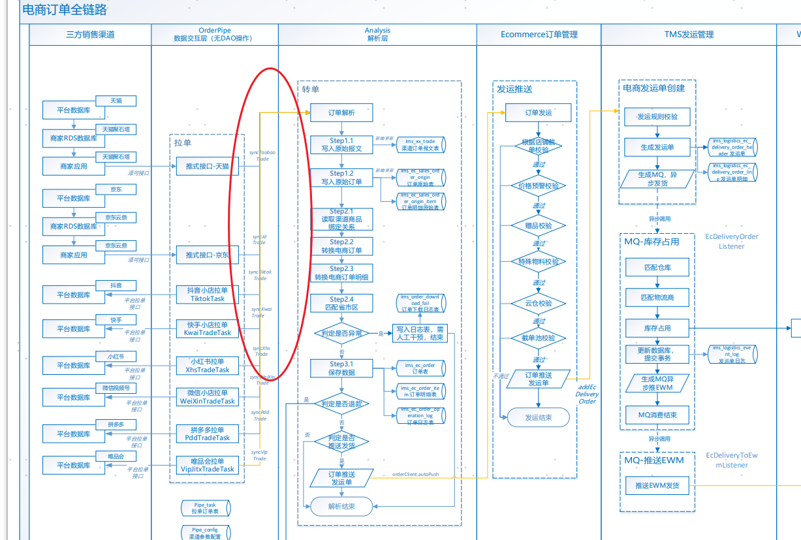

> HTML 页面: [[page/wiki/data/业务问题/TOC业务/电商/抖音直播秒退拉单慢.html|打开 HTML 页面]]

#### 问题概述:

抖音渠道，用户下单后退款，无法实时秒退，导致店铺评分降低

上周五陈赫直播，3万订单，系统拉单慢，22:14分还在同步21:54分的订单

#### 问题原因:

1）orderpipei TiktokTradeTask调用抖音接口拉取报文后，调用anlysis接口转单。目前是串行的，一单单处理。

2）监控analysis jvm，发现cpu、内存都是正常的

#### 解决方案:

orderPipe里调用完渠道接口拉取报文后  
1）若订单数据超过100，启用固定线程池线程 调用anlysis，3个并发可以提高3倍性能  
2）3个线程全部处理完成后， 继续拉单 /停止拉单

TiktokTradeTask

建议代码 参考css-finance里 concuurent并发包

注意：主流程要等待子线程跑完；多个子线程，任务均摊开来；

## 抖音秒退

|   |   |   |   |   |   |
|---|---|---|---|---|---|
|退款单|退款单|现状：退款单必须判定有 trade|方案1：不依赖trade  改造点1：  如果没有trade，查询订单新增消息  判定 十分钟内订单（查询msg表），直接秒退         改造点2：  增加监控，防止退款后超发|方案2：拉单拉的足够快         改造点：orderPipe增加多线程  问题点：拉抖音1分钟前订单，抖音接口会漏单|陈凯|
|漏单|拉单优化|现状：拉1分钟前的|改造：拉3分钟前的         上次同步时间： 11:09:59   当前时间： 11:11:00  开始时间： 11:09:54 （上次同步时间减5秒）   结束时间： 11:10:00 （当前时间减1分钟）||缪晨晨|
||漏单补偿|t_ims_tiktok_message创建订单消息，  但是`ims_tiktok_trade`没有数据，  需要补偿|1）sql捞数据  开始时间：3天内，  结束时间：3小时前；  限定100条         2）得到一批单号，调用现有orderpipe接口|ecommerce|储金谷|