#  **一、插件**

## **1.开发插件，插件是一个http接口，在珊瑚资源库-插件中配置**

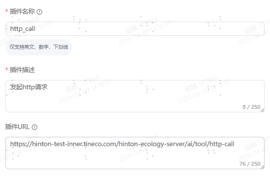

注意：

 1.接口鉴权
 
 2.接口的返回格式

{ 
  "references": [ 
    { 
      "content": "", //插件接口返回内容 
      "title": "" //插件接口描述 
    } 
  ], 
  "text": "" //必填，回调给模型的结果 
}

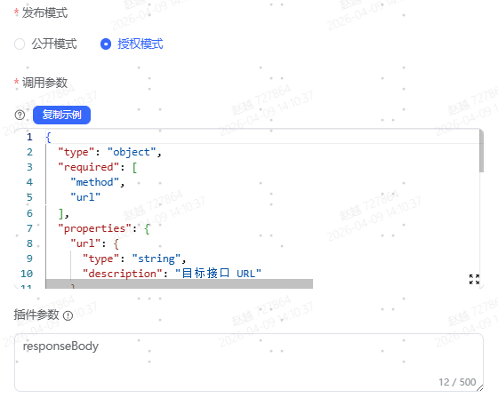

**在插件的调用参数中配置参数字段名称和类型，示例：**

{
 "type": "object",
 "required": [
  "method",
  "url"
 ],
 "properties": {
  "url": {
   "type": "string",
   "description": "目标接口 URL"
  },
  "body": {
   "type": "object",
   "description": "请求体（JSON/Form 等，POST/PUT 用）"
  },
  "method": {
   "type": "string",
   "description": "请求方法（GET/POST/PUT/DELETE 等）"
  },
  "params": {
   "type": "map",
   "description": "URL 参数（Query Params）"
  },
  "headers": {
   "type": "map",
   "description": "请求头（如 {\"Authorization\":\"Bearer token\", \"Content-Type\":\"application/json\"}）"
  }
 }
}

**配置完成后示例**

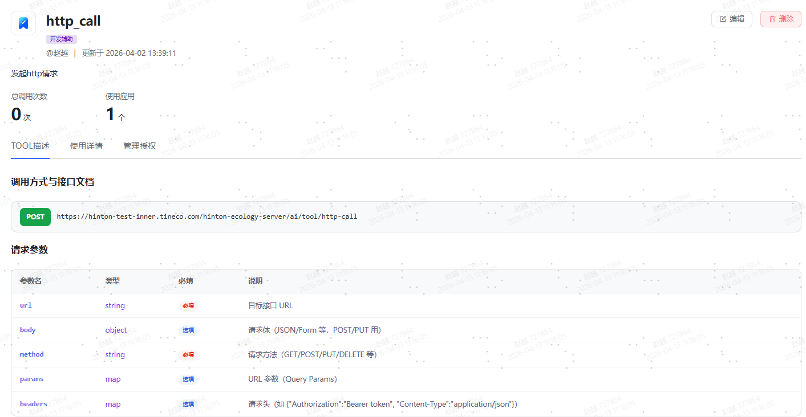

##  **2.使用插件**

**在AI对话中引入插件，设置调用次数，发送请求，大模型运行时会自动调用插件**

**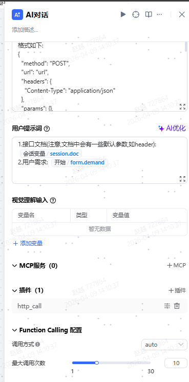**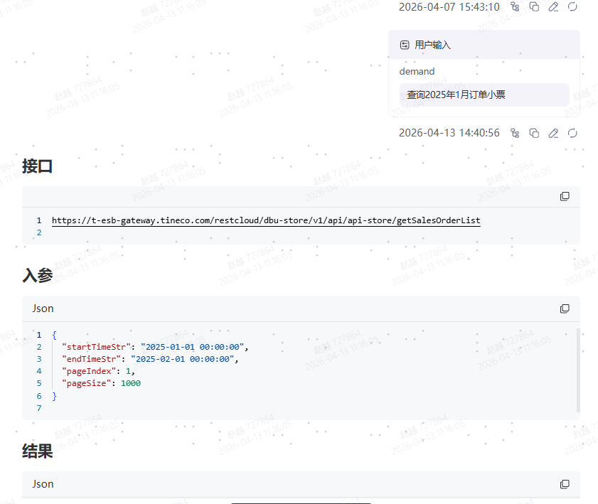


# **二、MCP**

**MCP是一个接口合集或者工具合集**

## **1.MCP作为远程接口合集使用**

### **第一步、珊瑚MCP接口描述json格式**

### **将自己的接口发布后，根据要发布的接口填写固定的json，描述接口的url，header，method，参数名，参数描述**


```
{  "url": "https://css-test.tineco.com/gateway",  "headers": {    "appkey": "64e803cc72f39917593897c7",    "Content-Type": "application/json"  },  "type": "http",  "tools": [    {      "name": "tineco_css_repair",      "path": "/asmServer/asmApiAgent/queryProgressByRepair",      "method": "POST",      "description": "根据手机号查询维修单进度",      "schema": {        "type": "object",        "properties": {          "form": {            "type": "object",            "properties": {              "customerPhone": {                "type": "string",                "description": "手机号"              }            },            "required": [              "customerPhone"            ]          }        },        "required": [          "form"        ]      }    }  ] }
```

### **第二步、MCP接口注册json格式**

**将接口json描述转义成字符串，填入到注册json的settings中**


```
{  "id": "2041754399236009985",  "name": "维修单进度查询",  "description": "维修单进度查询（派恩）",  "status": 1,  "clientType": "api",  "tools": [    {      "id": "2041754400200699905",      "settings": "{\"url\":\"https://css-test.tineco.com/gateway\",\"headers\":{\"appkey\":\"64e803cc72f39917593897c7\",\"Content-Type\":\"application/json\"},\"type\":\"http\",\"tools\":[{\"name\":\"tineco_css_repair\",\"path\":\"/asmServer/asmApiAgent/queryProgressByRepair\",\"method\":\"POST\",\"description\":\"根据手机号查询维修单进度\",\"schema\":{\"type\":\"object\",\"properties\":{\"form\":{\"type\":\"object\",\"properties\":{\"customerPhone\":{\"type\":\"string\",\"description\":\"手机号\"}},\"required\":[\"customerPhone\"]}},\"required\":[\"form\"]}}]}"    }  ] }
```

### **3.MCP配置json格式**

**将json部署到珊瑚MCP服务中，得到sse的接口配置**

**sse接口配置，要部署到珊瑚的MCP服务，需要联系珊瑚中心-周俭，也可以使用第三方的MCP接口**


```
{ 				"headers": { 					"X-API-Key": "ak-3ijwc0HauehNOd71" 				}, 				"type": "sse", 				"url": "https://coral-test.ecovacs.cn/coral-mcp-server/2042144711888449537/sse" 			}
```

#### **4.配置MCP**

**在珊瑚资源库-MCP中新建空间资源，安装方式选择SSE，内容填写sse接口**

**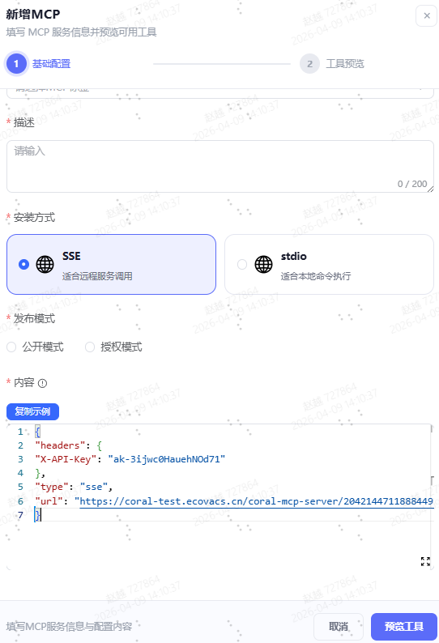**

## **2.使用MCP**

**选择Agent节点，策略选择支持MCP工具，选择MCP服务，发送请求，大模型自动调用MCP工具**

**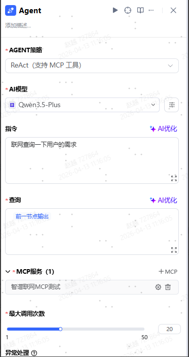**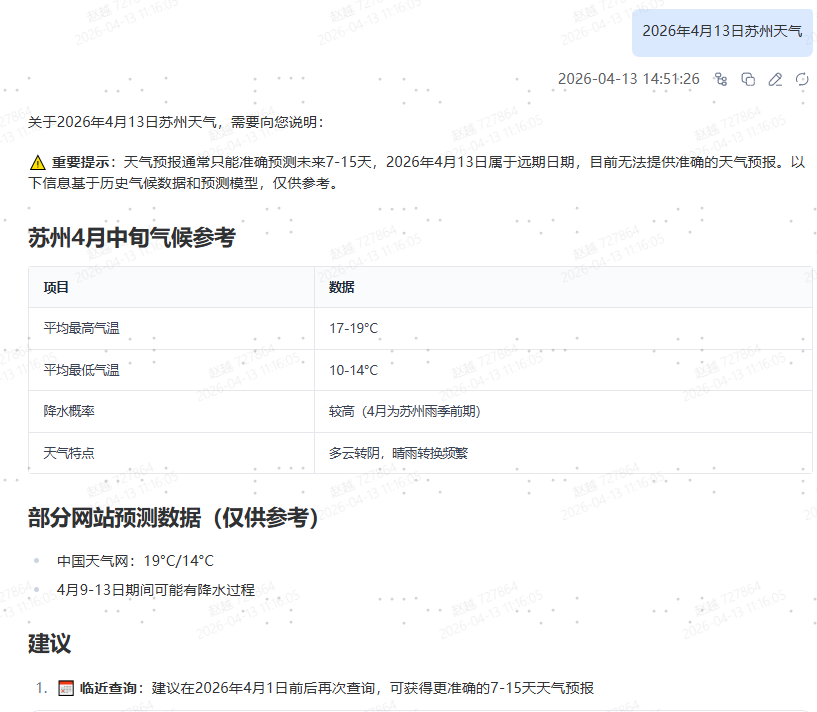

# **三、SKILL**

**SKILL可以只是一个SKILL.md文档，只在固定场景下对大模型进行约束，例如：翻译、文档生成、代码生成**

**也可以搭配python脚本使用，让大模型通过命令行执行python代码**

## **1.SKILL开发**

###  [SKILL.md](http://SKILL.md)文件，注意：在珊瑚平台中，SKILL文档的顶部必须有---包裹的定义部分，在文件上传时有校验

\---


name: send-notice

description: "Execute a Python script to send room notice messages. The model only needs to pass the user's natural language requirement as the message content."

argument-hint: "Pass the user's requirement/notice content directly"

user-invocable: true

\---

\## Purpose

This skill runs a pre-written Python script to send room notice messages.

\## How It Works
The model **only needs to pass one parameter**:
\- The user's natural language requirement / notice content

All API configurations, headers, and fixed parameters are **hardcoded inside the Python script** and do not need to be provided by the model.

\## Input
Only **one parameter** is required:
\- `message`: User's requirement or notice text

The Python script will automatically assemble the complete request and send it.

\## Example Usage
The model can directly call the script with the user's message:
\```
python send_notice.py --message "用户的通知内容"
\```

###  python脚本

\```
import argparse
import json
import requests
import sys

def main():
  parser = argparse.ArgumentParser(description="Send notice via ESB message API")
  \# 核心：只需要传入 message 参数
  parser.add_argument("--message", help="Notification message content")
  parser.add_argument("--input", help="Path to input JSON file (only need message field)")
  parser.add_argument("--dry-run", action="store_true", help="Only print request, do not send")

  args = parser.parse_args()

  \# 从 JSON 文件或命令行读取参数
  if args.input:
    with open(args.input, "r", encoding="utf-8") as f:
      data = json.load(f)
      message = data.get("message", "")
  else:
    message = args.message or ""

  \# 校验必填参数
  if not message:
    print("Error: message is required")
    sys.exit(1)

  \# 固定接口配置 + 默认参数（按接口文档）
  url = "https://esb-gateway.tineco.com/restcloud/css/gateway/messageServer/tcMessageRecord/sendTCMsg"
  headers = {
    "appkey": "62f5f201bfd0f10d93e7fa19",
    "Content-Type": "application/json"
  }
 
  \# 构造请求体（默认参数全部固定）
  payload = {
    "message": message,
    "roomCode": "TCR10004",
    "remindPeopleList": ["roomBot"],
    "remindPeopleNoList": ["roomBot"]
  }

  \# dry-run 只打印不发送
  if args.dry_run:
    print("=== DRY RUN ===")
    print(f"URL: {url}")
    print(f"Headers: {json.dumps(headers, ensure_ascii=False)}")
    print(f"Payload: {json.dumps(payload, ensure_ascii=False, indent=2)}")
    return

  \# 发送请求
  try:
    resp = requests.post(url, json=payload, headers=headers, timeout=10)
    print(f"Status: {resp.status_code}")
    print(f"Response: {resp.text}")
  except Exception as e:
    print(f"Request failed: {str(e)}")

if __name__ == "__main__":
  main()
\```

## **2. SKILL创建**

### **文件层级**

**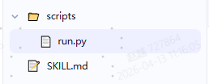**

### **打包文件夹成.zip压缩文件，注意：文件夹名称必须和skill工具名称一致**

**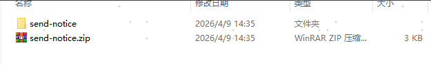**

### **上传压缩包到珊瑚资源库-SKILLS**

**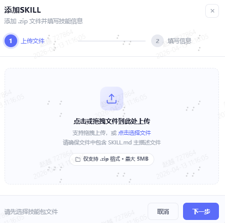**

**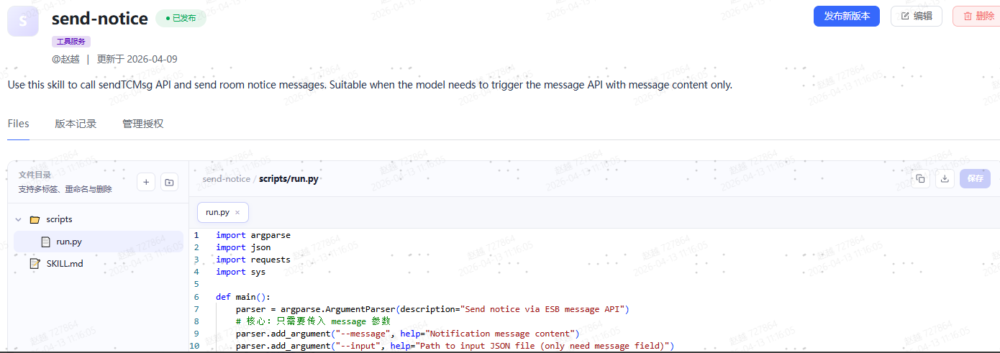**

## **3.SKILL使用示例**

**选择Agent节点，策略选择支持SKILLS，选择SKILL，发送请求，大模型根据用户意图调用SIKLL**

**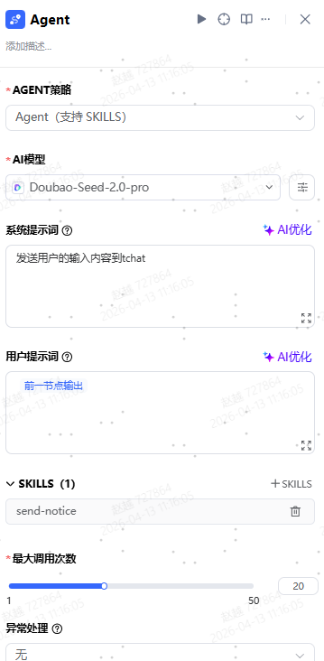**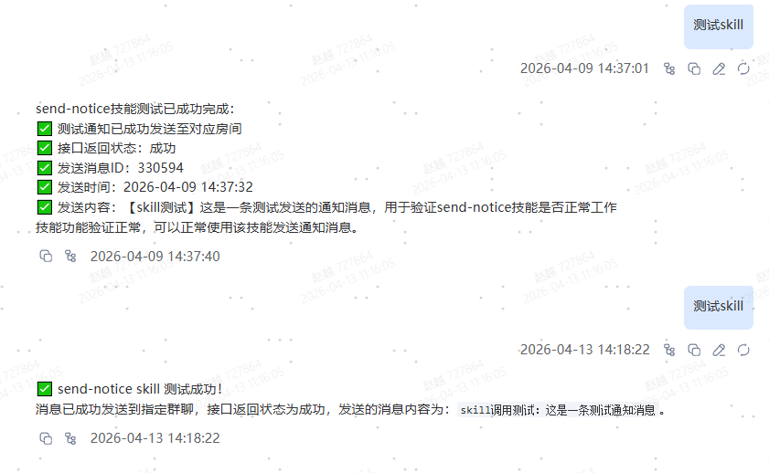

‍