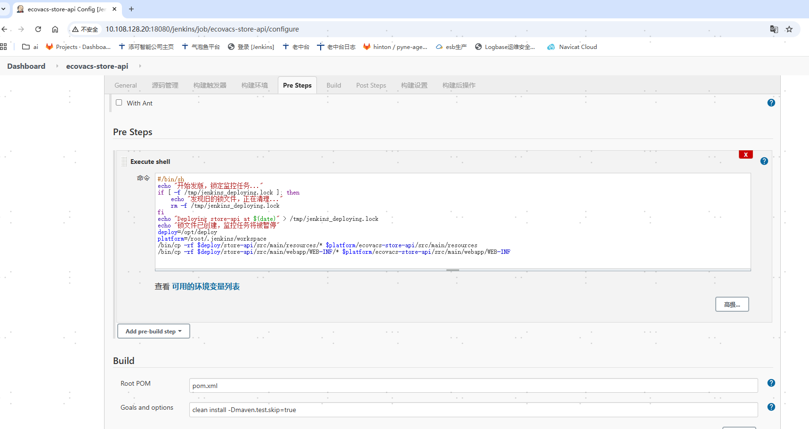
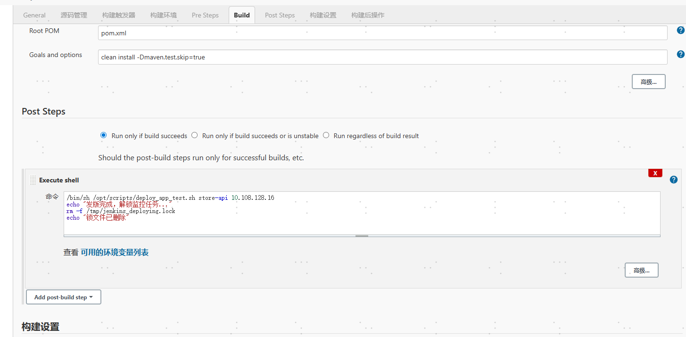
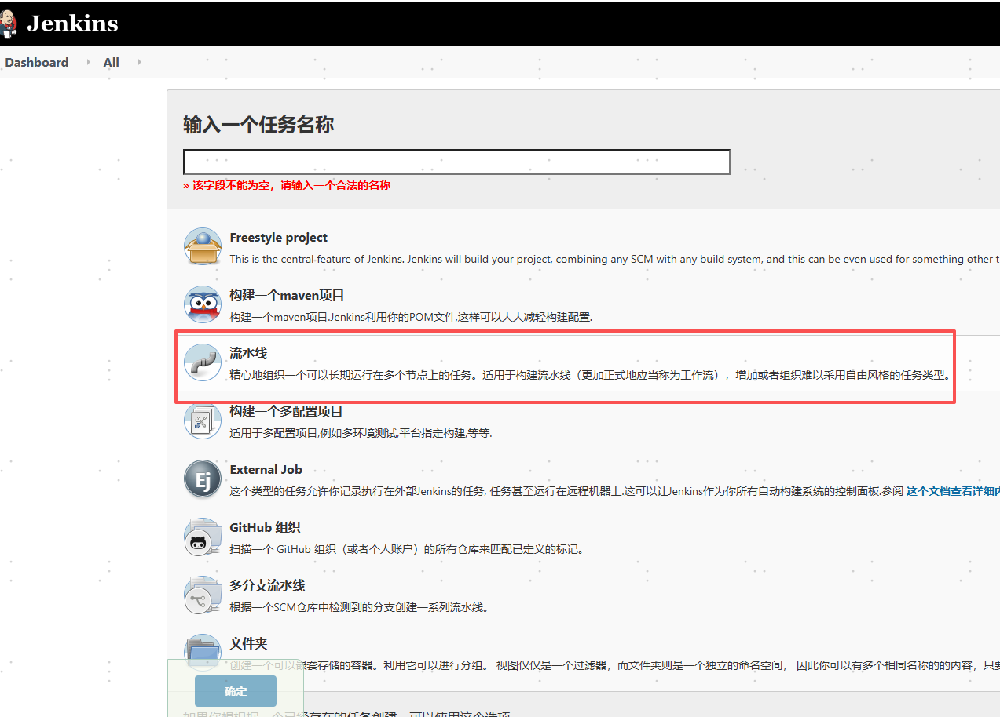
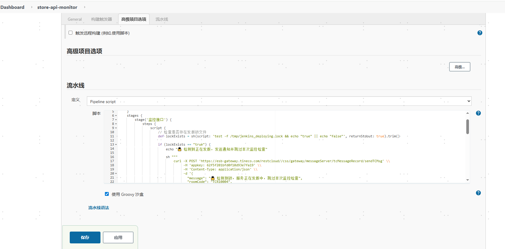
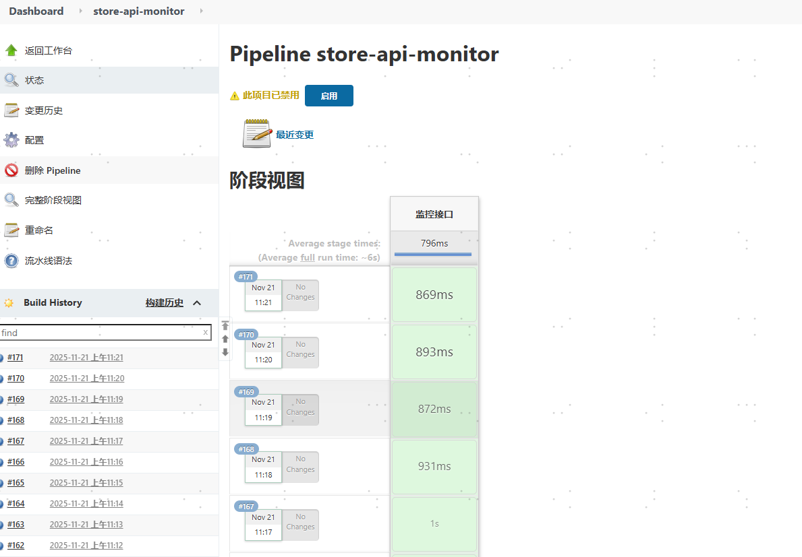

# 1.被监控任务发版流程加锁:
### 以ecovacs-store-api为例,在pre steps和post steps中增加锁配置




**<font style="color:rgb(31, 35, 40);">Pre Steps（执行shell）：</font>**

```plain
#!/bin/sh
echo "开始发版，锁定监控任务..."
if [ -f /tmp/jenkins_deploying.lock ]; then
    echo "发现旧的锁文件，正在清理..."
    rm -f /tmp/jenkins_deploying.lock
fi
echo "Deploying store-api at $(date)" > /tmp/jenkins_deploying.lock
echo "锁文件已创建，监控任务将被暂停"
deploy=/opt/deploy
platform=/root/.jenkins/workspace
/bin/cp -rf $deploy/store-api/src/main/resources/* $platform/ecovacs-store-api/src/main/resources
/bin/cp -rf $deploy/store-api/src/main/webapp/WEB-INF/* $platform/ecovacs-store-api/src/main/webapp/WEB-INF
```

**<font style="color:rgb(31, 35, 40);">Post Steps（执行shell）：</font>**

```plain
/bin/sh /opt/scripts/deploy_app_test.sh store-api 10.108.128.16
echo "发版完成，解锁监控任务..."
rm -f /tmp/jenkins_deploying.lock
echo "锁文件已删除"
```

# 2.增加Jenkins监控任务
### 新建Item, 选择流水线项目


### 添加pipeline脚本


### **<font style="color:rgb(31, 35, 40);">pipeline脚本逻辑:</font>**
1. <font style="background-color:#F8B881;">监控任务每3分钟执行一次(</font><font style="color:#800000;">每次执行其实相当于重新构建一次</font><font style="background-color:#F8B881;">)</font>
2. <font style="background-color:#F8B881;">获取锁文件</font>
3. <font style="background-color:#F8B881;">如果获取到锁, 说明当前正在发版, 发送通知</font><font style="color:#800000;">(一般不会获取到,Jenkins发版是逐个发版,store-api发版的时候,监控任务不会执行)</font>
4. <font style="background-color:#F8B881;">如果获取不到, 请求服务监控接口, 获取返回码</font>
5. <font style="color:#800000;">如果返回码不是200, 或者超时5秒, 重试两次, 还是不能返回200, 说明服务宕机或假死, 执行服务重新部署命令, 并发送通知</font>
6. <font style="background-color:#F8B881;">如果返回码是200, 本次任务结束</font>

```groovy
pipeline {
    agent any
    triggers {
        cron('H/3 * * * *')
    }
    stages {
        stage('监控接口') {
            steps {
                script {
                    // 检查是否存在发版锁文件
                    def lockExists = sh(script: 'test -f /tmp/jenkins_deploying.lock && echo "true" || echo "false"', returnStdout: true).trim()
                    
                    if (lockExists == "true") {
                        echo "检测到正在发版，发送通知并跳过本次监控检查"
                        
                        sh """
                            curl -X POST 'https://esb-gateway.tineco.com/restcloud//css/gateway/messageServer/tcMessageRecord/sendTCMsg' \\
                                 -H 'appkey: 62f5f201bfd0f10d93e7fa19' \\
                                 -H 'Content-Type: application/json' \\
                                 -d '{
                                   "message": "检测到锁，服务正在发版中，跳过本次监控检查",
                                   "roomCode": "TCR10004",
                                   "remindPeopleList": ["roomBot"],
                                   "remindPeopleNoList": ["roomBot"]
                                 }'
                        """
                        
                        currentBuild.result = 'SUCCESS'  // 标记为成功，避免报警
                        return
                    }
                    
                    // 设置重试参数
                    def maxRetries = 3
                    def timeoutSeconds = 5
                    def errorCount = 0
                    def timeoutCount = 0
                    def needRestart = false
                    
                    // 执行检查，最多3次
                    for (int i = 1; i <= maxRetries; i++) {
                        echo "第 ${i} 次接口检查..."
                        
                        try {
                            // 设置5秒超时，包含连接超时和最大时间
                            def statusCode = sh(
                                script: "curl -s -o /dev/null -w '%{http_code}' --connect-timeout ${timeoutSeconds} --max-time ${timeoutSeconds} https://store-api.tineco.cn",
                                returnStdout: true
                            ).trim()
                            
                            echo "第 ${i} 次接口状态码: ${statusCode}"
                            
                            if (statusCode.isInteger()) {
                                def code = statusCode.toInteger()
                                if (code == 200) {
                                    echo "接口返回200，状态正常，结束检查"
                                    needRestart = false
                                    break  // 正常状态，立即退出循环
                                } else {
                                    errorCount++
                                    echo "第 ${i} 次检查返回非200状态码: ${code}，当前错误计数: ${errorCount}"
                                    
                                    // 如果已经3次错误，设置重启标志并退出循环
                                    if (errorCount >= 3) {
                                        needRestart = true
                                        break
                                    }
                                }
                            } else {
                                // 如果返回的不是数字（可能是超时或其他错误信息）
                                timeoutCount++
                                echo "第 ${i} 次检查可能超时，返回内容: ${statusCode}，当前超时计数: ${timeoutCount}"
                                
                                // 如果已经3次超时，设置重启标志并退出循环
                                if (timeoutCount >= 3) {
                                    needRestart = true
                                    break
                                }
                            }
                            
                        } catch (Exception e) {
                            // 捕获执行过程中的异常（如超时异常）
                            timeoutCount++
                            echo "第 ${i} 次检查发生异常: ${e.getMessage()}，当前超时计数: ${timeoutCount}"
                            
                            // 如果已经3次超时，设置重启标志并退出循环
                            if (timeoutCount >= 3) {
                                needRestart = true
                                break
                            }
                        }
                        
                        // 如果不是最后一次检查且还未达到重启条件，等待1秒后再进行下一次检查
                        if (i < maxRetries && !needRestart) {
                            sleep(1000) // 等待1秒
                        }
                    }
                    
                    echo "检查完成 - 错误计数: ${errorCount}, 超时计数: ${timeoutCount}, 需要重启: ${needRestart}"
                    
                    // 判断是否需要重启
                    if (needRestart) {
                        echo "检测到接口连续异常（${errorCount}次非200状态码，${timeoutCount}次超时），开始执行重启脚本..."
                        
                        // 执行重启脚本
                        sh "/bin/sh /opt/scripts/deploy_app_test.sh store-api 10.108.128.16"
                        
                        echo "已执行重启脚本"
                        
                        // 发送通知消息
                        def errorType = errorCount >= 3 ? "非200状态码" : "超时"
                        def errorTimes = errorCount >= 3 ? errorCount : timeoutCount
                        
                        sh """
                            curl -X POST 'https://esb-gateway.tineco.com/restcloud//css/gateway/messageServer/tcMessageRecord/sendTCMsg' \\
                                 -H 'appkey: 62f5f201bfd0f10d93e7fa19' \\
                                 -H 'Content-Type: application/json' \\
                                 -d '{
                                   "message": "Tineco Store API监控异常，${errorType}连续出现${errorTimes}次，已自动执行重启脚本",
                                   "roomCode": "TCR10004",
                                   "remindPeopleList": ["roomBot"],
                                   "remindPeopleNoList": ["roomBot"]
                                 }'
                        """
                    } else {
                        echo "接口状态正常，无需重启"
                    }
                }
            }
        }
    }
}

```

```groovy
pipeline {
    agent any
    triggers {
        cron('H/3 * * * *')
    }
    stages {
        stage('监控接口') {
            steps {
                script {
                    // 检查是否存在发版锁文件
                    def lockExists = sh(script: 'test -f /tmp/jenkins_deploying.lock && echo "true" || echo "false"', returnStdout: true).trim()
                    
                    if (lockExists == "true") {
                        echo "🔒 检测到正在发版，发送通知并跳过本次监控检查"
                        
                        sh """
                            curl -X POST 'https://esb-gateway.tineco.com/restcloud//css/gateway/messageServer/tcMessageRecord/sendTCMsg' \\
                                 -H 'appkey: 62f5f201bfd0f10d93e7fa19' \\
                                 -H 'Content-Type: application/json' \\
                                 -d '{
                                   "message": "🔒 检测到锁，服务正在发版中，跳过本次监控检查",
                                   "roomCode": "TCR10004",
                                   "remindPeopleList": ["roomBot"],
                                   "remindPeopleNoList": ["roomBot"]
                                 }'
                        """
                        
                        currentBuild.result = 'SUCCESS'  // 标记为成功，避免报警
                        return
                    }
                    
                    // 正常的监控逻辑
                    def statusCode = sh(
                        script: 'curl -s -o /dev/null -w "%{http_code}" https://store-api.tineco.cn',
                        returnStdout: true
                    ).trim().toInteger()
                    
                    echo "接口状态码: ${statusCode}"
                    
                    if (statusCode != 200) {
                        echo "检测到接口异常，开始触发重启任务..."
                        
                        withCredentials([usernamePassword(
                            credentialsId: 'jenkins-api-token', 
                            usernameVariable: 'USERNAME', 
                            passwordVariable: 'TOKEN'
                        )]) {
                            sh """
                                curl -u "$USERNAME:$TOKEN" -X POST 'http://localhost:18080/jenkins/job/ecovacs-store-api/build?token=1690799918&cause=宕机自动重启'
                            """
                        }
                        echo "✅ 已触发重启任务"
                        
                        sh """
                            curl -X POST 'https://esb-gateway.tineco.com/restcloud//css/gateway/messageServer/tcMessageRecord/sendTCMsg' \\
                                 -H 'appkey: 62f5f201bfd0f10d93e7fa19' \\
                                 -H 'Content-Type: application/json' \\
                                 -d '{
                                   "message": "🚨 Tineco Store API监控异常，状态码：${statusCode}，已自动触发重启任务",
                                   "roomCode": "TCR10004",
                                   "remindPeopleList": ["roomBot"],
                                   "remindPeopleNoList": ["roomBot"]
                                 }'
                        """
                    } else {
                        echo "接口状态正常"
                    }
                }
            }
        }
    }
}

```

# 3.构建监控任务,测试并查看日志



# 4.生产环境监控脚本
```groovy
pipeline {
    agent any
    triggers {
        cron('H/3 * * * *')
    }
    stages {
        stage('监控接口') {
            steps {
                script {
                    // 检查是否存在发版锁文件
                    def lockExists = sh(script: 'test -f /tmp/jenkins_deploying.lock && echo "true" || echo "false"', returnStdout: true).trim()
                    
                    if (lockExists == "true") {
                        echo "检测到正在发版，发送通知并跳过本次监控检查"
                        
                        sh """
                            curl -X POST 'https://esb-gateway.tineco.com/restcloud//css/gateway/messageServer/tcMessageRecord/sendTCMsg' \\
                                 -H 'appkey: 62f5f201bfd0f10d93e7fa19' \\
                                 -H 'Content-Type: application/json' \\
                                 -d '{
                                   "message": "检测到锁，服务正在发版中，跳过本次监控检查",
                                   "roomCode": "TCR10004",
                                   "remindPeopleList": ["roomBot"],
                                   "remindPeopleNoList": ["roomBot"]
                                 }'
                        """
                        
                        currentBuild.result = 'SUCCESS'  // 标记为成功，避免报警
                        return
                    }
                    
                    // 定义监控的服务器列表
                    def servers = [
                        '10.108.224.105:8084',
                        '10.108.224.106:8084'
                    ]
                    
                    def abnormalServers = []
                    
                    // 循环检查每台服务器
                    servers.each { server ->
                        def statusCode = sh(
                            script: "curl -s -o /dev/null -w '%{http_code}' http://${server} --connect-timeout 5 --max-time 10",
                            returnStdout: true
                        ).trim().toInteger()
                        
                        echo "服务器 ${server} 状态码: ${statusCode}"
                        
                        if (statusCode != 200) {
                            abnormalServers.add(server)
                            echo "检测到服务器 ${server} 接口异常"
                        } else {
                            echo "服务器 ${server} 接口状态正常"
                        }
                    }
                    
                    // 处理异常服务器
                    if (abnormalServers.size() > 0) {
                        echo "检测到 ${abnormalServers.size()} 台服务器异常，开始执行重启操作..."
                        
                        abnormalServers.each { server ->
                            def ip = server.split(':')[0]
                            echo "开始重启服务器: ${ip}"
                            
                            // 执行重启脚本，传入服务器IP
                            sh "/bin/sh /opt/scripts/deploy_app_test.sh store-api ${ip}"
                            
                            echo "已执行重启脚本 for ${ip}"
                        }
                        
                        def serverList = abnormalServers.join(', ')
                        sh """
                            curl -X POST 'https://esb-gateway.tineco.com/restcloud//css/gateway/messageServer/tcMessageRecord/sendTCMsg' \\
                                 -H 'appkey: 62f5f201bfd0f10d93e7fa19' \\
                                 -H 'Content-Type: application/json' \\
                                 -d '{
                                   "message": "Tineco Store API监控异常，异常服务器: ${serverList}，已自动执行重启脚本",
                                   "roomCode": "TCR10004",
                                   "remindPeopleList": ["roomBot"],
                                   "remindPeopleNoList": ["roomBot"]
                                 }'
                        """
                    } else {
                        echo "所有服务器接口状态正常"
                    }
                }
            }
        }
    }
}

```

