> HTML 页面: [[page/wiki/data/工具/Outlook使用技巧.html|打开 HTML 页面]]

### 技巧1、发邮件，如何撤回邮件
背景：发送邮件后，发现有纰漏，需要撤回后重发

操作：如下图

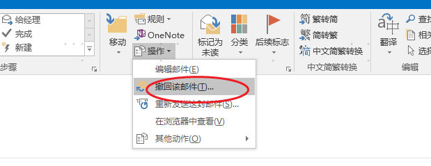

### 技巧2、发邮件，立即发送-》延迟1分钟发送，实现邮件预览
背景：发送邮件，点击《发送》按钮，目前是立即发送，需延迟发送，邮件预览自查自纠

操作：如下

|     |     |
| --- | --- |
| 效果展示-发送邮件 | 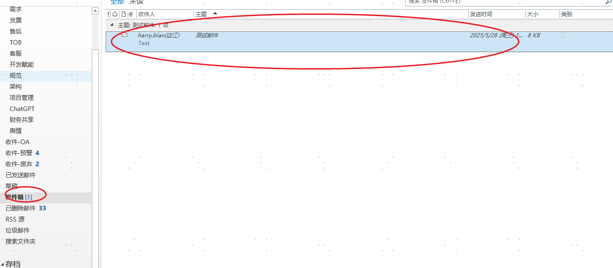 |
| 步骤1：打开规则页面 | 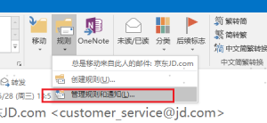 |
| 步骤2：新建规则 |  |
| 步骤3： 选择"对我发送的邮件应用规则"; 选择"下一页" | 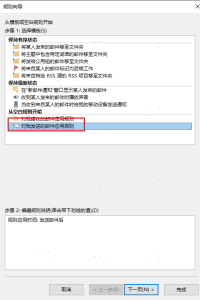 |
| 步骤4： 选择"仅在计算机上"; 选择"下一页" | 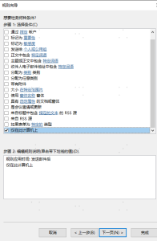 |
| 步骤5： 选择"传递推迟若干分钟"; 选择输入框，填写"1"； 选择"完成"； | 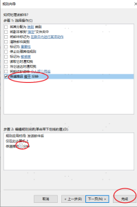 |
| 步骤6： 检查规则是否正确 | 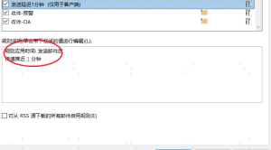 |

### **技巧3：收邮件，实现自动分类**
背景：邮件多，希望收到邮件后，自动分类。

操作：通过设置规则，邮件迁移到不同文件夹

|     |     |
| --- | --- |
| 最终效果图 | 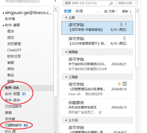 |
| 步骤1：打开规则页面 |  |
| 步骤2：新建规则 | 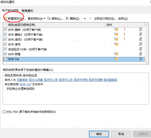 |
| 步骤3： 选择“将某人发来的邮件移至文件夹”； 填写发件人信息，点击"个人或公用组" 填写分类文件夹，点击"指定"； 选择"完成"         | 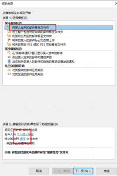     |
| 步骤4： 检查规则     | 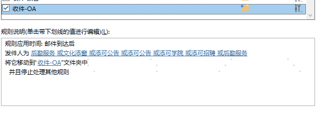 |
| 步骤5： 立即运行规则，将现有收件箱中邮件分类 | 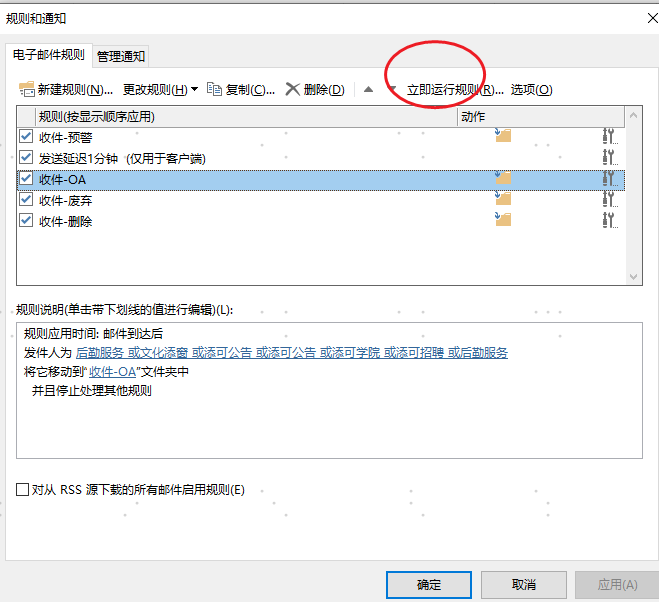 |

  

  

