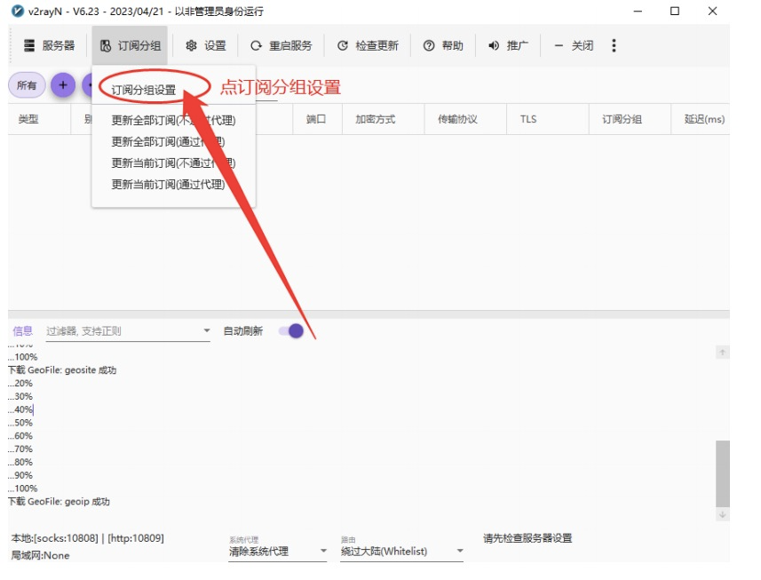
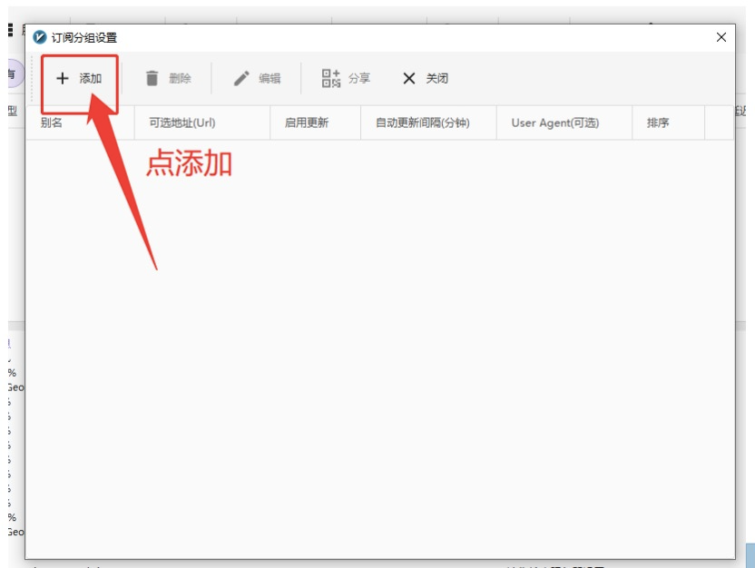
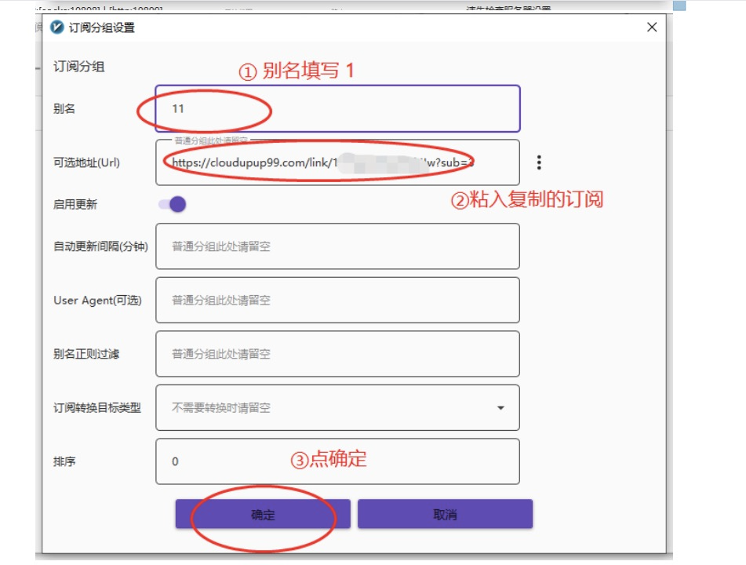
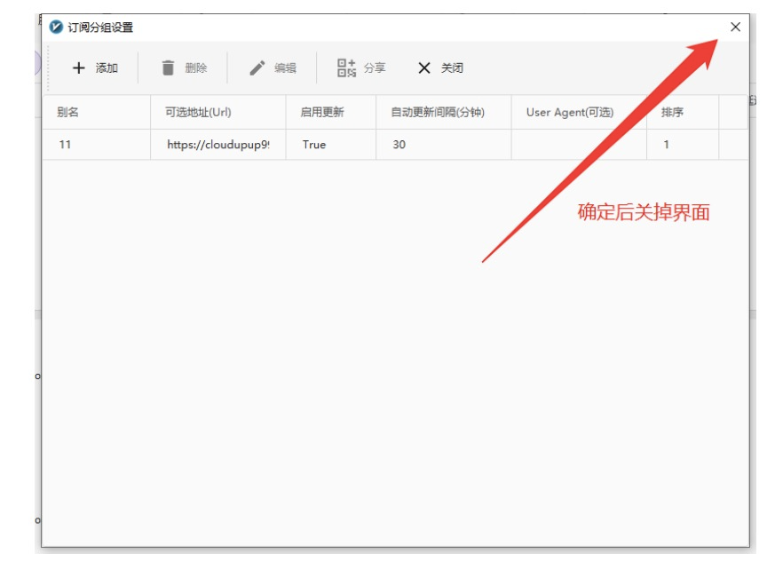
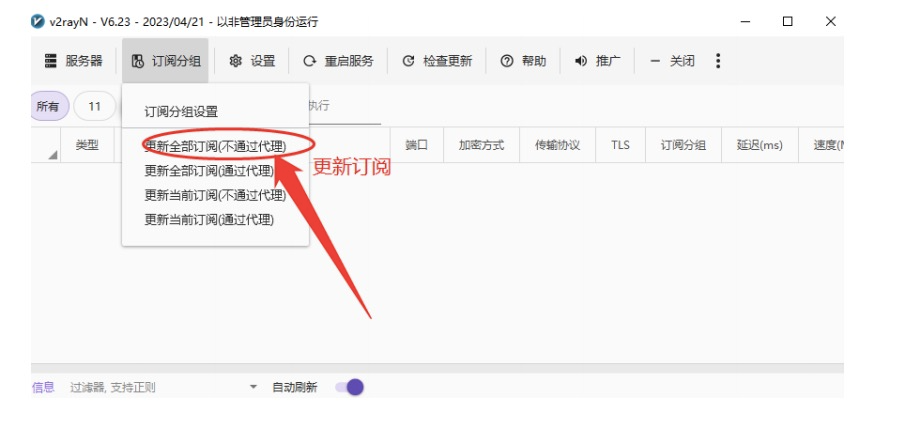
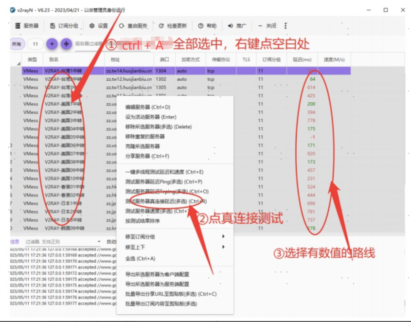
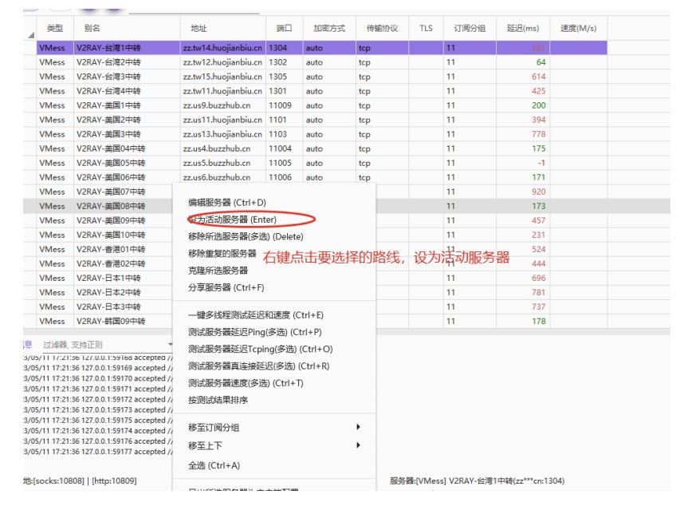
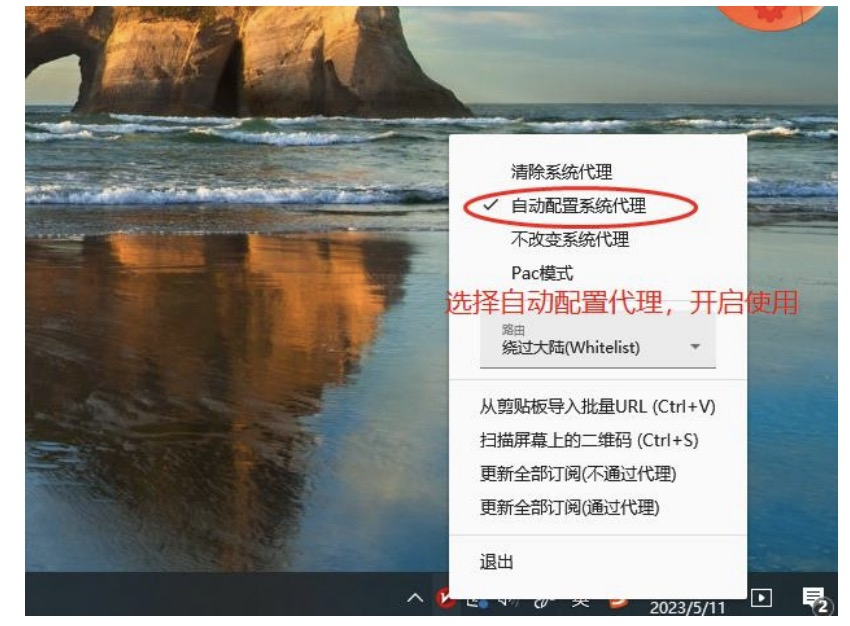

> HTML 页面: [[page/wiki/data/工具/V-2-Ray for Windows 使用教程.html|打开 HTML 页面]]

### 1.文件下载
Windows版: [https://dbu-file.tineco.cn:7443/data/dbu/store/2025-11-27/0af4c11b-becc-46a2-ab03-4332167b47ef.zip](https://dbu-file.tineco.cn:7443/data/dbu/store/2025-11-27/0af4c11b-becc-46a2-ab03-4332167b47ef.zip)

安卓app: [https://dbu-file.tineco.cn:7443/data/dbu/store/2025-11-27/864f355a-e13a-474f-be3c-d99c72bbfb0c.apk](https://dbu-file.tineco.cn:7443/data/dbu/store/2025-11-27/864f355a-e13a-474f-be3c-d99c72bbfb0c.apk)

clash.verge下载链接: [https://dbu-file.tineco.cn:7443/data/dbu/store/2025-12-04/375b7639-9ef5-4a28-83f0-ce5501d33e3c.exe](https://dbu-file.tineco.cn:7443/data/dbu/store/2025-12-04/375b7639-9ef5-4a28-83f0-ce5501d33e3c.exe)

nekoBox下载链接: [https://dbu-file.tineco.cn:7443/data/dbu/store/2025-12-04/8ae25e26-5bec-457e-9634-b21b07ca719b.apk](https://dbu-file.tineco.cn:7443/data/dbu/store/2025-12-04/8ae25e26-5bec-457e-9634-b21b07ca719b.apk)

### 2.导入订阅

### 3.开始使用
#### 1.测试速度

#### 2.选择节点

#### 3.开启代理

#### 4.关闭连接
+ **不需要使用代理时，请右键任务栏图标 → 选择“清除系统代理”即可断开连接。**

