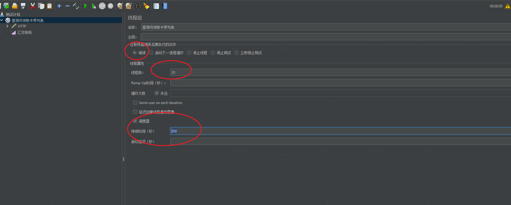
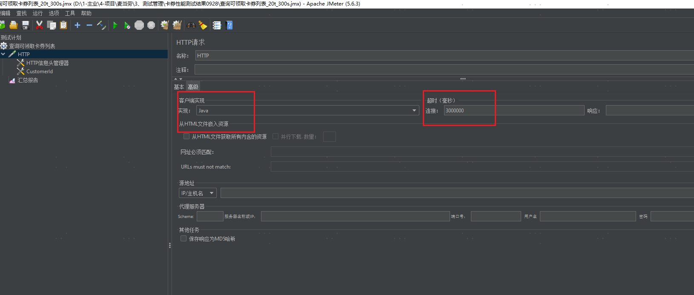
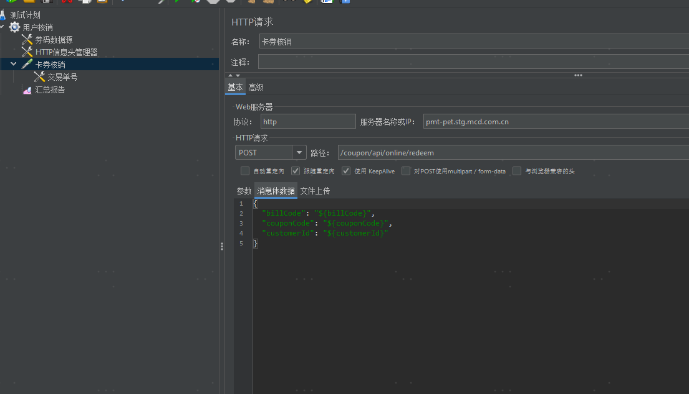
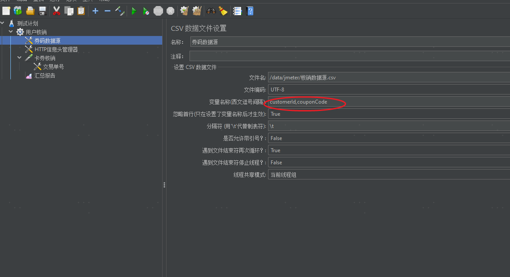
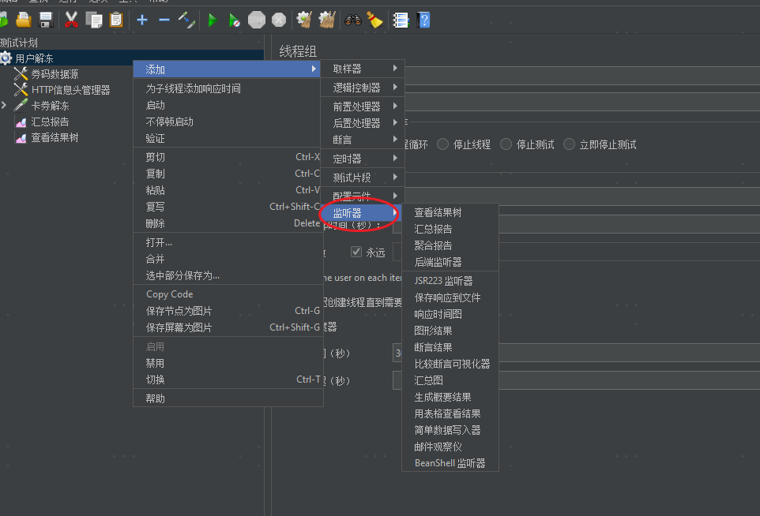
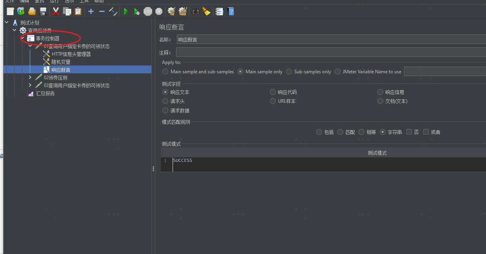

### 1.Jmeter安装
1>安装jdk

2>下载Jmeter [Apache JMeter - Apache JMeter™](https://jmeter.apache.org/)

3>解压安装包, 配置环境变量

JMETER_HOME: Jmeter安装路径

4>运行: bin>jmeter.bat

### 2.测试脚本
| 测试用例 | 1、单接口压测 《库存事务》，每次操作1个库存 1）sapId 跑5个，10个并发，每次操作1个 2、单接口压测 《库存事务》，每次操作5个库存 3、多个接口混合场景压测 |
| --- | --- |
| 测试脚本 | [卡券性能测试结果0928.rar](http://10.108.128.23:8090/download/attachments/4784743/%E5%8D%A1%E5%88%B8%E6%80%A7%E8%83%BD%E6%B5%8B%E8%AF%95%E7%BB%93%E6%9E%9C0928.rar?version=1&modificationDate=1713862260000&api=v2) |
| 测试工具 | \\10.108.128.20\share\软件\apache-jmeter-5.6.3 |
| 测试报告 | [查询可领取卡券列表_60t_300s.rar](http://10.108.128.23:8090/download/attachments/4784743/%E6%9F%A5%E8%AF%A2%E5%8F%AF%E9%A2%86%E5%8F%96%E5%8D%A1%E5%88%B8%E5%88%97%E8%A1%A8_60t_300s.rar?version=1&modificationDate=1713862593000&api=v2) |
| 性能分析工具 | Arthas - 开源 Java 诊断工具 |

### 3.测试流程
| 定义线程组     | 1、定义线程数 2、定义持续时间 |  |
| ---------------------------------------------------------- | ------------------------------------------------------------ | ------------------------------------------------------------ |
| 定义http请求   | 1、设置java实现 http请求 2、设置超时 |  |
| 入参           | 1）定义http头信息         |                  |
|                | 2）入参，随机变量（配置元件） |  |
|                | 3）入参，读取文件（配置元件，参考解冻） |  |
| 出参           | 增加出参断言 参考《单场景-查询后领券事务_20t_300s》 |                  |
| 查看结果       | 1、《汇总报告》 2、《查看结果树》 |  |
| 多个接口一起跑 | 1、增加事务管理器 2、增加出参断言 参考《单场景-查询后领券事务_20t_300s》 |  |

