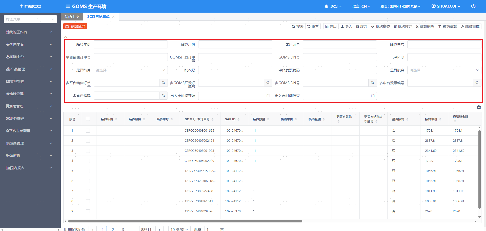

# GOMS电商订单模块功能架构

# 一、系统定义

- 营销中台（GOMS）：主营业务处理系统，负责全渠道预测管理、库存管理、销售管理、销售发票管理等

- WMS：工厂直发仓库使用的仓储系统

- 班牛：班牛为平台端即时沟通中插件工具

- CSS：全渠道售后业务管理系统

- SAP：ERP系统

- 财务共享：财务共享管理系统

- 资金系统：资金管理系统

- 菜鸟云仓：阿里系的菜鸟仓储服务体系，通过阿里奇门接口对接

# 二、电商订单系统架构

## 功能模块一栏

# 三、电商订单全链路

流程说明：

## 1、订单拉单（三方销售渠道→OrderPipe 数据交互层）

1. 从天猫、京东、抖音、快手、小红书、微信、拼多多、唯品会等**三方销售渠道**的平台数据库、商家 RDS 数据库、商家应用拉取订单数据。

2. 各渠道通过专属拉单任务（如天猫拉单、京东拉单、抖音小店拉单等）完成订单拉取，进入 OrderPipe 数据交互层。

## 2、订单解析（Analysis 解析层）

1. 订单进入解析层后，执行**订单解析**：写入原始报文、原始订单，提取商品信息、转换电商订单组、匹配销售区。

2. 依次判定订单是否异常、是否退款、是否需要发货，完成**订单围堵**并生成发货单，最终解析结束。

3. 异常 / 退款 / 围堵等特殊订单会单独处理，正常订单则流转至后续环节。

## 3、订单推送与截单（Ecommerce 订单管理）

1. 解析完成的正常订单执行**发运推送**：订单发运前经价格预警校验、赠品校验、特殊物料校验、云仓校验、截单池校验等环节。

2. 校验通过则生成**DeliveryOrder**，进入发运流程；校验不通过则触发**截单**，生成截单请求。

3. 截单请求会推送至 EWM 仓储管理系统的截单接口。

## 4、发运执行（TMS 发运管理）

1. 接收 Ecommerce 订单管理的发运指令，执行**电商发运单创建**：

    - 完成规则校验、生成发运单，通过 MQ 异步发货。

    - 执行**MQ \- 库存占用**：匹配仓库、物流商，锁定库存。

    - 调用库存冻结接口，更新事务、生成拣货单，同步至 WMS 库存管理。

2. 发运单通过 MQ 推送至 EWM 仓储管理系统，触发 EWM 发货流程。

## 5、仓储执行（WMS 库存管理→EWM 仓储管理系统）

1. WMS 接收 TMS 的库存占用、拣货指令，完成库存管理相关操作。

2. EWM 仓储管理系统接收 TMS 推送的发货指令，通过出库接口完成出库；接收截单指令，通过截单接口处理截单业务。

## 6、核心流转节点

1. 订单数据从**三方渠道**拉取→经**OrderPipe**汇总→进入**解析层**处理→推送至**Ecommerce 订单管理**校验。

2. 校验通过→**TMS 发运管理**执行发运→**WMS/EWM**完成仓储出库；校验不通过则触发**截单**流程。

## 7、订单状态映射

微信视频号

淘宝

京东

4\.苏宁

5\.新官网

6\.老官网

7\.拼多多

8\.抖音

9\.小红书

10\.快手

11\.小米有品 

12\.有赞

# 四、业务流程

电商订单场景内分为：

- 非云仓

- 菜鸟大环云仓

- 菜鸟中环云仓

- 京东云仓

差异主要体现在：

- 推单前是否需要先补云仓子仓/库位

- 发货结果最终是由外部 WMS 回调驱动，还是由云仓平台发货信息任务直接落单驱动

### 流程文字说明

1. **订单接入**：系统通过定时任务从各电商平台（淘宝、京东、抖音、快手等）自动下载订单数据，或由运营人员通过 Excel 手工导入订单

2. **订单审核**：运营人员对订单进行锁定、信息修改（物流公司、发货方式、收货地址等）、审核通过；部分订单支持系统自动审核

3. **赠品/拆单处理**：根据业务规则为订单添加赠品、补寄赠品，或将大订单拆分为多个子订单

4. **订单推送**：将审核通过的订单推送到中台 OMS，生成销售单和发货单，同时进行额度占用

5. **仓库发货**：OMS 下发发货指令到 WMS/云仓/菜鸟仓，仓库执行拣货发货，获取物流信息

6. **发货回传**：将发货信息（物流公司、快递单号）同步回电商平台，订单状态变更为已发货

7. **异常处理**：下载失败、推送失败、回传失败的订单进入各自的异常处理队列，支持人工重试或系统自动重试

8. **订单截单/取消**：对于需要取消的订单，执行截单操作，通知中台取消并释放已占用的额度

### 1、订单发货业务流程（厂发）

### 2、订单发货业务流程（菜鸟大环）

### 3、订单发货业务流程（菜鸟中环）

### 4、GOMS 正向订单开票全链路

### 5、电商发运单全链路

### 6、发运单状态流转图

### 7、匹配仓库失败场景

### 8、截单（消费者取消订单）

### 9、作废发运单

### 10、拆单逻辑

场景1：赠品拆单 — 业务流程图

**触发条件**：平台订单中同时包含赠品商品和大货商品

场景2：菜鸟云仓拆单

**触发条件**：订单行中同时包含菜鸟云仓商品和非云仓商品（混合订单）

场景3：SKU/安装服务拆单 — 业务流程图

**触发条件**：订单行中包含标记了"需要按件拆分"或"安装服务"的商品

### 11、2C寄售结算单业务流程

- **功能说明：**

1、消费者下单，生成电商订单，并推送电商发运单发货，判断订单是否已发货？

- \-是，推送2C寄售结算单， 

- \-否，等待订单发货或者订单是否已作废

2、订单是否是售后补发订单

- \-是，不推送2C寄售结算单， 

- \-否，进行下一步判断

2、推送2C寄售结算池时判断该单是否历史已有结算单据

- \-是，进行下一步判断

- \-否，推送待结算池

3、寄售结算池已存在的单据是否已结算

\-是，已存在历史结算单据，无法重复生成

- \-否，自动匹配结算生成批次号

2、新增核销结算按钮，具体导入模版包含：**GOMS厂发订单号，结算数量（逆向数量为负数），结算单价，结算金额，结算单号，结算月份，结算年份，**

**导出报表字段顺序按照导入模版调整一致**

- 根据导入的订单号匹配寄售结算池的待结算单号

匹配校验项：

①12订单号/工单号是否存在？ \-是，校验下一步 \-否，订单不存在无法匹配

②结算数量是否一致？\-是校验下一步 \-否，报错数量不一致

③结算金额的数据导入到核算金额内

3、财务提交批次号推送至国内中台生成FP，前置校验是否成功？

- \-是，正常推送国内中台，并生成FP单号回传2C寄售结算单

- \-否，展示推送报错信息，调整数据逻辑

4、**新增筛选项：是否结算，平台销售订单、GOMS DN号、GOMS厂发订单号、中台发票编号、客户编码均需多选以及商品发出时间**

5、人工导入的入口需要做权限隔离，统一一个归口人，引导财务BP按照新的导入结算流程操作

6、新老寄售结算单需要校验重复性，系统自动生成推送到2C结算单需要校验结算池能是否重复，人工导入后需要校验是否有重复，如果已存在且未结算，那直接匹配，并生成批次号，如果已存在并且已结算，则报错有重复结算单据（原SAP校验接口需要保留）

7、结算单推送国内中台校验报错信息需要按照明细行回传展示在2C寄售，弹窗附件的形式——优先上线

8、期初上线时需要将历史待结算数据进行批量导入，后续如果有遗漏数据则有归口人按照人工导入结算路径导入

# 五、功能说明

## 1、电商订单管理

电商订单管理是 GOMS 系统的核心业务模块，负责对接国内多个电商平台（淘宝/天猫、京东、抖音、快手、拼多多、唯品会、有赞、小红书等）的销售订单全生命周期管理。模块解决的核心问题是：将来自不同电商平台的订单统一接入、标准化处理，并完成审核、推送至中台 OMS、发货回传、发票管理等闭环流程，同时支持门店订单、寄售订单、分销渠道订单等多种业务场景。

该模块是连接电商平台与企业内部 ERP/WMS/TMS 系统的枢纽，日常处理大量订单的自动下载、人工审核、批量推送、发货信息回传等操作，同时为售后（CSS系统）、财务（SAP）、物流（TMS/WMS）等下游系统提供订单数据支撑。

### ①电商订单

#### 涉及系统与服务

#### 1、界面原型

#### 2、页面描述

电商订单管理主模块，主要承接各大平台的订单，数据颗粒度为订单行

##### a、检索区

**快捷标签**：售后、门店、推送、退款、标记、云仓、云仓人工、锁定、我的、导入、作废、组合商品、补赠、订单备注、卖家备注、买家备注、非淘订单菜鸟仓、非淘订单菜鸟仓推送、云转厂、直播间订单快速筛选特殊订单。

##### b、列表页

##### C、功能区

页头功能按钮（8项）

批量操作按钮（13项）

表单操作按钮（9项）

### ②下载失败订单

#### 涉及系统与服务

#### 1、界面原型

#### 2、页面描述

下载失败订单模块，记录从各电商平台下载订单过程中出现异常的订单，支持手动/自动重试下载和忽略处理。

##### a、检索区

##### b、列表页

##### c、功能区

### ③回传失败订单

#### 涉及系统与服务

#### 1、界面原型

#### 2、页面描述

回传失败订单模块，记录发货信息回传至各电商平台失败的订单，支持手动/自动重试回传和忽略处理。系统通过XXL\-JOB定时任务自动重试，并通过钉钉消息推送告警。

##### a、检索区

##### b、列表页

##### c、功能区

### ④电商原订单

#### 涉及系统与服务

#### 1、界面原型

#### 2、页面描述

电商原订单模块，保存从各电商渠道下载的原始订单数据（不经业务处理），支持列表查询和详情查看，同时为CSS售后系统提供原始订单查询接口。

##### a、检索区

##### b、列表页

##### c、功能区

无额外功能按钮，主要通过点击列表中的ID或来源单号进入详情页。

详情页包含5个模块：

1. 订单详情：来源单号、所属店铺、订单类型、下单时间、订单状态、优惠金额、物流方式、买家昵称、卖家备注、买家备注

2. 收货地址：收货人姓名、固定电话、手机号码、收货地区（省\-市\-区）、详细地址

3. 支付方式：支付方式、支付时间、支付金额、备注

4. 开票信息：发票类型、发票抬头

5. 商品明细：退款状态、商品名称、数量、商品售价、小计

### ⑤电商历史订单

#### 涉及系统与服务

#### 1、界面原型

#### 2、页面描述

电商历史订单模块，存储已发货和已作废的历史订单数据，支持多维度查询、导出和京东自营订单同步，数据颗粒度为订单行。

##### a、检索区

##### b、列表页

|序号|列名|字段|说明|
|---|---|---|---|
|9|商品金额|totalAmount|宽度120|
|10|实际金额|actualAmount|宽度120|
|11|优惠分摊|discountFee|宽度120|
|12|商品数量|totalProductCount|宽度100|
|13|订单状态|orderStatus|字典IMS\_EC\_ORDER\_STATUS转换，宽度100|
|14|订单来源|orderSource|字典IMS\_EC\_ORDER\_SOURCE转换，宽度100|
|15|发货方式|ecShippingType|字典IMS\_EC\_SEND\_MODEL转换，宽度160|
|16|订单分类|orderType|PRODUCT/大货订单，GIFT/赠品订单，宽度100|
|17|物流单号|transportNumber|宽度150|
|18|收货人|receiverName|宽度80|
|19|省份|receiverState|宽度80|
|20|城市|receiverCity|宽度80|
|21|区县|receiverDistrict|宽度80|
|22|收货地址|receiverAddress|宽度300|
|23|退款标记|refundFlag|YN转换|
|24|部分退款标记|partRefundFlag|YN转换|
|25|云仓标记|hasForceWlb|YN转换|
|26|云仓人工标记|ecovacsWlbFlag|YN转换|
|27|云转仓标记|cloudOrCompanyMsg|YN转换|
|28|组合商品标记|combineFlag|YN转换|
|29|是否寄售|consignType|YN转换|
|30|售后订单号|asmSalesOrderNo|文本|
|31|售后工单号|asmOrderNo|文本|
|32|店铺订单状态|status|文本|
|33|物流公司|transportCompanyName|文本|
|34|物流方式|shippingType|文本|
|35|买家备注|buyerMessage|文本|
|36|卖家备注|sellerMemo|文本|
|37|导入批次号|importBatchNo|文本|

##### c、功能区

### ⑥导入订单批次管理

#### 涉及系统与服务

#### 1、界面原型

#### 2、页面描述

导入订单批次管理模块，用于通过Excel模板批量导入订单（支持线上/线下/指定仓库等多种模式），管理导入批次记录，支持批次转换和审批流程。

##### a、检索区

##### b、列表页

##### c、功能区

详情页包含2个表格：

6. 订单信息表：来源单号、是否为大货订单赠品、仓库编码、库位编码、收货人、收货人手机、收货省/市/区/地址、客户编码、客户名称、支付日期、是否开发票、发票抬头、发票类型、税号、发票金额、发票备注、买家备注、卖家备注、是否干线发货

7. 商品明细表：来源单号、产品SAP ID、产品名称、商品等级、实际单价、发货数量（≥5时红色显示）、应发SN、备注

### ⑦修改订单批次管理

#### 涉及系统与服务

#### 1、界面原型

#### 2、页面描述

修改订单批次管理模块，用于通过Excel模板批量修改订单的收货地址或备注信息，管理修改批次记录，支持批次更新。

##### a、检索区

##### b、列表页

##### c、功能区

下载模板（2项）：

- 修改地址导入模板下载

- 修改备注导入模板下载

详情页按类型展示不同字段：

- Type=3 修改地址：订单号、收货人、收货人手机号、客户编码、客户名称、收货省/市/区/地址、修改状态（0=未修改/1=修改成功/2=修改失败）

- Type=4 修改备注：订单号、客户编码、客户名称、买家备注、卖家备注、修改状态

修改前置条件：订单必须存在且未发货（pushShippingFlag≠1），否则修改失败。

### ⑧店铺与产品绑定

#### 涉及系统与服务

#### 1、界面原型

#### 2、页面描述

店铺与产品绑定模块，用于建立电商平台店铺商品与中台SAP物料的映射关系，支持组合商品配置、拆单设置、菜鸟仓配置等，所有变更记录操作日志。

##### a、检索区

##### b、列表页

##### c、功能区

详情页（新增/修改）：

- 选择店铺 → 输入店铺商品信息（ID、名称、编码、规格编码）

- 通过产品模态框添加中台物料明细（productSku、productSapId、productName）

- 配置项：商品等级、产品分类、数量、价格、税率、虚拟标志、赠品标志、SKU拆单标志

- 菜鸟仓配置：b2cCaiNiaoFlag、itemId、itemCode

- 多物料绑定时自动设置combineFlag=1

### ⑨京东自营商品绑定

#### 涉及系统与服务

#### 1、界面原型

#### 2、页面描述

京东自营商品绑定模块，用于建立京东自营平台商品编码与中台SAP物料ID的映射关系，绑定后自动更新RPA订单转换标记。

##### a、检索区

##### b、列表页

##### c、功能区

### ⑩2C寄售结算单

#### 涉及系统与服务

#### 1、界面原型

#### 2、页面描述

2C寄售结算单模块，用于管理寄售模式下的订单结算、发票管理和财务核销，支持两种导入模板（厂发模式、2C结算），批次管理和财务系统推送。

##### a、检索区

##### b、列表页

##### c、功能区

## 2、电商发运单

电商发运单（EC Delivery Order）是 GOMS 电商系统中管理发货全流程的核心业务模块。从电商订单推送开始，经过发运单创建 → 仓库匹配 → 库存锁定 → 推送WMS出库 → 发货回传平台 → 库存扣减 → 推送SAP财务 → 签收的完整链路。

#### 1、界面原型

#### 2、页面描述

##### a、检索区

##### b、功能区

## 3、赠品申请

**总体介绍**

**\(1\)常规赠品规则：**日常购买大货的赠品活动规则

**\(2\)直播赠品规则：**针对与直播活动的特殊活动方案赠品规则，优先取直播活动的赠品的规则

**\(3\)团购赠品规则：**用户参与平台团购活动，根据活动方案生成的赠品规则，优先于常规赠品

**\(4\)客服备注赠品规则：**客服在建工单的时候，会进行一些补偿，会在订单打备注生成对应赠品来分发给消费者

**\(5\)前N名加赠赠品规则：**可以叠加在常规赠品或者其他赠品规则，如果在前N名额外放发赠品来吸引消费者购买

**\(6\)线下门店赠品规则：**针对于线下门店配置的赠品规则，满足不同经销商门店的赠品方案

**\(7\)加赠权益活动赠品规则：**在原有的赠品规则上能额外给消费者加赠赠品的规则方案,常见为一分钱补赠

## **赠品规则匹配流程**

Ø仅在大货发货后24小时触发匹配赠品规则

Ø匹配赠品规则仅可匹配一次，不会重复匹配赠品规则生成赠品

### ①常规赠品活动管理

#### 涉及系统与服务

#### 1、界面原型

#### 2、页面描述

常规赠品活动管理模块，用于配置线上常规赠品活动规则（按店铺\+商品\+时间维度），支持活动审批、启停、赠品规则批量导入，是赠品匹配引擎7级优先级中第3级的数据来源。

##### a、检索区

##### b、列表页

##### c、功能区

列表行操作按钮（4项）

详情页功能按钮（6项）

详情页活动规则表格字段：

### ②团购赠品活动管理

#### 涉及系统与服务

#### 1、界面原型

#### 2、页面描述

团购赠品活动管理模块，用于配置团购场景下的赠品规则，通过团购关键词匹配卖家/买家备注来确定赠品发放，是赠品匹配引擎7级优先级中第2级的数据来源。与常规活动的主要差异在于增加了团购关键词\(keyword\)匹配和猫宁标记\(isNotMaoning\)。

##### a、检索区

##### b、列表页

##### c、功能区

列表行操作按钮（4项）

详情页功能按钮（6项）

详情页活动规则表格字段：

### ③直播赠品活动规则

#### 涉及系统与服务

#### 1、界面原型

#### 2、页面描述

直播赠品活动规则模块，用于配置直播场景下的赠品规则，通过卖家/买家备注关键词\+活动时间来匹配赠品发放，是赠品匹配引擎7级优先级中第1级（最高优先级）的数据来源。

##### a、检索区

##### b、列表页

##### c、功能区

列表行操作按钮（4项）

详情页功能按钮（6项）

### ④加赠权益活动规则

#### 涉及系统与服务

#### 1、界面原型

#### 2、页面描述

加赠权益活动规则模块，用于配置预订加赠场景的赠品规则——买家在预订期内购买了预定商品后，在正式购买主商品时额外赠送。是赠品匹配引擎7级优先级中第5级的数据来源，可与其他规则叠加。

##### a、检索区

##### b、列表页

##### c、功能区

列表行操作按钮（4项）

详情页功能按钮（6项）

详情页活动规则表格字段（与常规活动类似，增加预订物料相关字段）：

### ⑤前N名加赠规则

#### 涉及系统与服务

#### 1、界面原型

#### 2、页面描述

前N名加赠规则模块，用于配置限量前N名下单买家的赠品规则——付款时间在活动期内且排名在N名以内的买家可获得赠品。是赠品匹配引擎7级优先级中第6级的数据来源，可与其他规则叠加。

##### a、检索区

##### b、列表页

##### c、功能区

列表行操作按钮（4项）

详情页包含赠品行表维护功能（新增/编辑/删除赠品行），详情页字段包括：产品编码\(productSapNo\)、产品名称\(productName\)、赠品编码\(largessSapNo\)、赠品名称\(largessName\)、赠品数量\(largessCount\)、预估数量\(forecastCount\)、前多少名赠送\(beforeManyGiving\)、开始时间\(beginTime\)、结束时间\(endTime\)、状态\(status\)、关联活动号\(activityNo\)、店铺\(shopName/shopNo\)

### ⑥小渠道赠品活动

#### 涉及系统与服务

#### 1、界面原型

#### 2、页面描述

小渠道赠品活动模块，用于配置非主流电商平台（非淘宝/京东/B2C）的赠品规则，适用于店铺标记createGiftFlag=2的订单。小渠道订单走独立的匹配逻辑，与主渠道7级优先级匹配链分开。

##### a、检索区

##### b、列表页

##### c、功能区

列表行操作按钮（4项）

详情页功能按钮（6项）

小渠道还包含独立的**客服备注表**管理页面（ImsOnlineSmallChannelLargessRule\.vue），用于配置小渠道的客服备注匹配规则，字段包括：activityNo、sellerNoteKeywords、buyerNoteKeywords、largessSapNo、largessCount、forecastCount、status、auditStatus、shopNo、beginTime、endTime等。

### ⑦客服备注加赠规则

#### 涉及系统与服务

#### 1、界面原型

#### 2、页面描述

客服备注加赠规则模块，通过匹配卖家/买家备注中的关键词来确定赠品发放，是赠品匹配引擎7级优先级中第4级（备注匹配）和第7级（兜底匹配）的数据来源。注意：关闭后无法再次启用。

##### a、检索区

##### b、列表页

##### c、功能区

列表行操作按钮（3项）

详情页表单字段：

### ⑧线下门店赠品活动

#### 涉及系统与服务

#### 1、界面原型

#### 2、页面描述

线下门店赠品活动模块，用于配置线下门店的赠品活动规则，支持标配赠品/条件赠品/套购赠品/自提赠品四种活动类型。审批通过后可启用活动并生成赠品明细结果，明细结果支持禁用/启用管理。

##### a、检索区

##### b、列表页

##### c、功能区

列表行操作按钮（2项）

