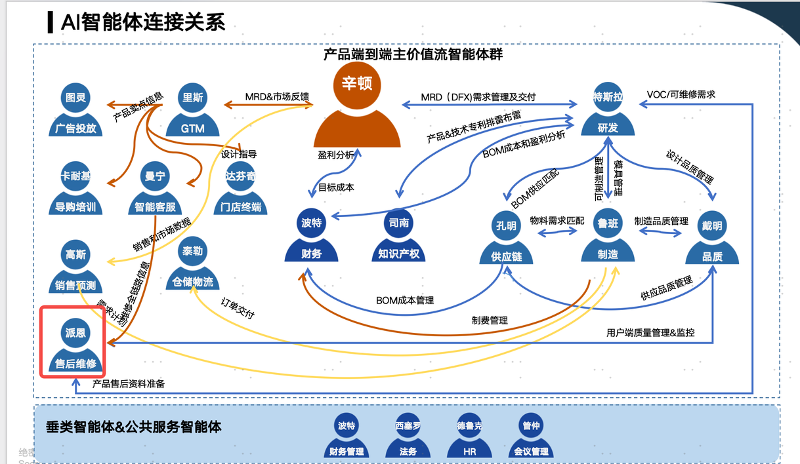

+ **多端输入，多端输出，不同端的输入应该是不一样的，不同端的输出也应该是不一样的**

  

1. **可维修性评估**

输入：

1. 可维修性需求文档
    1. 外部市场可维修性技术（什么形式的输入）
    2. 用户体验需求（是否有模板）
2. 历史同类型产品售后维修数据（故障的部件？什么形式的输入）
3. 产品结构
4. 手板样机组装评审

以上这些输入，是否最终汇总成DFX需求文档？

参与手板组装后，是否才能结合DFX，输出报告？

手板，EB，不同阶段都有进行可维修性评估，不同阶段的输入分别是什么？产品结构图？

关于交付物，资料中出现三个交付物：可维修性评估报告，MRD，ECN变更，具体交付哪一个？

是否在评估报告中增加 “根据同类型产品历史维修数据，针对新品结构进行优化的建议”

输出：可维修性报告（是否有标准模板？什么阶段输出（手板装配，EB））

报告内容：

1. 产品可维修性评估内容
    1. 评估对象：主机，地刷，基站，附件
    2. 评估内容：维修维度和成本维度
        1. 维修维度：拆卸难度，外观件可拆行，结构可靠性
        2. 成本维度：拆卸易损性，配件组成形式，配件通用性
2. 产品可维修性评估与目标
    1. 对比老品的维修指标，制定新品的维修目标，对比维度如下

| M3累计维修率 |
| --- |
| M3单台材料成本 |
| 主机拆机时长 |
| 地刷拆机时长 |
| 基站拆机时长 |
| 安装时长 |
| 安装质量退货率 |
| 安装非质量退货率 |

1. 产品可安装性评估内容
    1. 评估对象：安装环境要求，进水要求，排水要求，功能调试
    2. 评估内容：环境适应性，安装可靠性，安装效率
        1. 环境适应性：安装环境要求明确，进水压力要求达标，排水管高度明确、长度可调
        2. 安装可靠性：进水管密封配套完善，排水管密封配套完善
        3. 安装效率：进水、排水管安装简单，调试流程简单明确
2. 产品可安装性评估与目标
    1. 对比相似产品，评估安装流程的步骤和时间
3. 产品可维修性评估表（来源？是否模板化？）
4. 产品可维修性评估改善项（主机，地刷，基站）
    1. 检查项目（来源？），问题描述，改善对策，改善收益，效果确认（哪个组织评估确认？）
5. 产品可安装性评估改善项
    1. 检查项目，问题描述，改善对策，改善收益，效果确认

  

过去经验-->可维修建议-->手板样机组装评审->可维修建议(最小拆卸单元)

人为组装-->怎么转成知识库（装配图）

按品类拆装点检条目 --业务---侧重点

A类型项目才有，输出形式待定

  

根据结构图，维修数据，电教条目优化新品点检条目

1. **备件****BOM****搭建**

输入：

1. 产品结构（输入形式）
2. 价格规则 （输入形式）
3. 研发BOM
4. 同类产品的备件BOM
5.  

输出：

1. BOM （是否有模板，当前的产生逻辑）
    1. 产品BOM，售后备件BOM （这两个有什么区别，应用场景和生成逻辑的差异）
2. 售后价格 （模板）

当前的售后BOM是什么样的，依据哪些信息来列的清单，

配件价格核算的参考依据文档或系统

配件下单流程

自动生成配件订单并流转至生产、仓储

配件的仓储查询在该Agent里面吗？

EB样机拆机-->根据经验-->输出可替换备件清单

国内--拆到最小单元

拆解是否会增加大量工时，工时的历史数据

大中小修

通用件知识库

售后BOM = 研发BOM + 包装 + 标贴

包装工程师设计配件包装 114

特斯拉--> 派恩（料号）--> 特斯拉 --> 鲁班 --> 派恩 交互

价格：派恩 --> 波特 （成本价，销售价）

1. **备件预测、预警**

输入：

同品类售后维修数据

备件BOM

仓储信息

预测模型

下单API

输出：

1. **维修****SOP**

当前SOP的产出逻辑？

输入：

产品结构图

产品装配图

同品类售后维修数据

同品类的SOP

输出：

产品维修SOP（是否有模板）

1. 维修前的注意事项
2. 文件说明
3. 拆机SOP（图文步骤）
4. 维修指引：常见故障，分类，现象，可能原因，解决方案

1. **故障信息接收**

当前的流程是什么？

曼宁

1. **故障初步诊断**

当前的流程是什么？

曼宁

1. **制定维修方案**

当前的流程是什么？

售后反馈信息输入的形式，维修检测流程

代替现有人工进行的维修异常单据稽查稽核，怎么判断维修单据是否异常

输入：

曼宁维修建议

维修工单，故障描述（文本，视频）

维修SOP

产品结构

工作日志

输出：

维修方案（可能性最大，成本最优）

包含费用结算单

允许修改方案，修改后再输入系统，优化派恩

1. **费用审核**

当前的流程是什么？

维修师傅手动录入

派恩输出费用结算单，允许修改方案，修改后再反馈，优化派恩

1. **维修问题反馈**

当前的流程是什么？

重复问题一直出现

  

  

