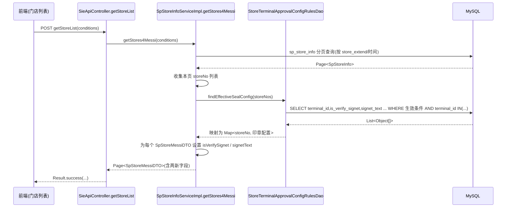

> HTML 页面: [[page/wiki/data/添可项目/老中台/2026年/20260706梅西小票检核功能迭代/门店列表接口_印章校验字段_开发设计文档.html|打开 HTML 页面]]

# 门店列表接口增加"是否校验印章 / 校验印章文本"字段 开发设计文档

> 项目：`dbu-platform-2.0`（模块 `ecovacs-store`）
> 接口：`POST /api/api-store/getStoreList`（网关路由 → `store-mgr` 的 SIE 控制器）
> 实际改造方法：`SpStoreInfoService.getStores4Messi(...)`（SIE "梅西"门店列表）
> 关联页面：终端审单规则详情页 `configRules/detail`

---

## 1. 背景与目标

在门店管理后台的门店列表查询接口（`getStores4Messi`，对外暴露为 `POST /api/api-store/getStoreList`）返回结果中，**每个门店需要额外携带其"当前生效的终端审单规则"中的印章校验配置**，用于列表页直观展示该门店是否开启印章校验、以及校验的印章文本。

- 新增字段 1：**是否校验印章**（`isVerifySignet`，0=否 / 1=是）
- 新增字段 2：**校验印章文本**（`signetText`，字符串）

---

## 2. 现状调研结论（重要）

经代码核查，印章校验能力**在后端数据模型中已存在**，无需新增数据库表字段：

| 层 | 类 / 文件 | 已有字段 | 表列 |
|---|---|---|---|
| 实体 | `SpStoreTerminalApprovalConfigRules` | `isVerifySignet` / `signetText` | `is_verify_signet` / `signet_text` |
| DTO | `SpStoreTerminalApprovalConfigRulesDTO` | 同上 | — |
| VO | `StoreTerminalApprovalConfigRulesVO` | 同上 | — |
| 表 | `sp_store_terminal_approval_config_rules` | — | 已建列（见 §6 校验） |

调用链（已确认）：

```
POST /api/api-store/getStoreList
  └─ SieApiController.getStoreList(@RequestBody SearchStoreRateConditions)   [store-mgr]
       └─ storeInfoService.getStores4Messi(conditions)                       [store-base]
            └─ 返回 Page<SpStoreMessiDTO>   ← 每个门店 = 一个 SpStoreMessiDTO
```

门店与规则的关联关系（见 `StoreTerminalApprovalConfigRulesDao` 原生 SQL）：
- 规则通过 `terminal_id = sp_store_info.store_no` 关联门店；规则实体同时冗余了 `store_id`。
- 一条"生效中"的规则判定条件（沿用现有 `selectAll` 逻辑）：
  - `delete_flag = 0`
  - `status = 0`（生效）
  - `audit_status IN ('COMPLETED','LAPSE_TOBE_HEADQUARTERS_REVIEW')`
  - `now() BETWEEN start_time AND end_time`

> **结论**：本次改造属于"数据回显"，不涉及新表/新列（除非 §6 校验发现线上库缺列），改动集中在 **DAO 批量查询 → 在 `getStores4Messi` 内回填 → 响应 DTO `SpStoreMessiDTO` 增加两字段 → 前端列表渲染**。

---

## 3. 总体方案

在 `getStores4Messi` 返回前，**批量**查出本次门店列表中各门店的"当前生效规则印章配置"，注入到每个 `SpStoreMessiDTO`，避免 N+1 查询。



---

## 4. 涉及文件清单

| 层 | 文件 | 改动类型 |
|---|---|---|
| 响应 DTO | `ecovacs-store/store-base/src/main/java/com/ecovacs/store/dto/company/SpStoreMessiDTO.java` | 新增两字段 |
| DAO | `ecovacs-store/store-base/src/main/java/com/ecovacs/store/dao/rule/StoreTerminalApprovalConfigRulesDao.java` | 新增批量方法 |
| Service 实现 | `ecovacs-store/store-base/src/main/java/com/ecovacs/store/service/company/impl/SpStoreInfoServiceImpl.java` | 注入规则 DAO + 在 `getStores4Messi` 内回填 |
| （无需改）控制器 | `ecovacs-store/store-mgr/src/main/java/com/ecovacs/store/mgr/controller/api/sie/SieApiController.java` | 仅透传，无需改动 |
| 前端 | 门店列表页（调用 `getStoreList`） | 新增两列（前端仓库不在本工程，见 §8） |

---

## 5. 详细改动设计

### 5.1 响应 DTO：`SpStoreMessiDTO` 增加两字段

文件：`ecovacs-store/store-base/src/main/java/com/ecovacs/store/dto/company/SpStoreMessiDTO.java`

```java
/** 是否校验印章 0-否 1-是（取自门店当前生效的终端审单规则） */
private Integer isVerifySignet;
/** 校验印章文本（取自门店当前生效的终端审单规则） */
private String signetText;
```

> `SpStoreMessiDTO` 使用 Lombok `@Data`，自动生成 getter/setter，无需手写。

### 5.2 DAO 层：新增批量查询方法

文件：`ecovacs-store/store-base/src/main/java/com/ecovacs/store/dao/rule/StoreTerminalApprovalConfigRulesDao.java`

在接口中追加（沿用现有 `@Query(nativeQuery = true)` 风格，已 import `Collection`、`@Param`）：

```java
/**
 * 批量查询门店当前生效规则的印章校验配置
 * 生效条件：未删除、状态生效、审核已完成/失效待总部审、当前时间在规则有效期内
 * 一个 terminal_id 在同时刻至多一条生效规则（系统有时间重叠校验）
 *
 * @param storeNos 门店编号(store_no)集合
 * @return 每行 [terminal_id, is_verify_signet, signet_text]
 */
@Query(value = "SELECT terminal_id, is_verify_signet, signet_text " +
        "FROM sp_store_terminal_approval_config_rules " +
        "WHERE delete_flag = 0 AND status = 0 " +
        "AND audit_status IN ('COMPLETED','LAPSE_TOBE_HEADQUARTERS_REVIEW') " +
        "AND now() BETWEEN start_time AND end_time " +
        "AND terminal_id IN :storeNos " +
        "ORDER BY id DESC", nativeQuery = true)
List<Object[]> findEffectiveSealConfig(@Param("storeNos") Collection<String> storeNos);
```

> `ORDER BY id DESC` + 实现层"同 key 取首次命中"确保即使出现数据异常（同一门店多条生效规则），也只取最新一条。

### 5.3 Service 实现：`SpStoreInfoServiceImpl` 注入并回填

文件：`ecovacs-store/store-base/src/main/java/com/ecovacs/store/service/company/impl/SpStoreInfoServiceImpl.java`

#### 5.3.1 注入规则 DAO（在现有 `@Autowired` 区块追加）

```java
@Autowired
private StoreTerminalApprovalConfigRulesDao approvalConfigRulesDao;
```

> `StoreTerminalApprovalConfigRulesDao` 与 `SpStoreInfoServiceImpl` 同属 `store-base` 模块，可直接注入，无循环依赖风险。

#### 5.3.2 改写 `getStores4Messi`（当前位于约第 5887 行）

在原方法第 4 步（转换 DTO）之前，先收集 `storeNo` 列表并批量查询印章配置；再在第 4 步循环内为每个 DTO 赋值。

```java
@Override
public Page<SpStoreMessiDTO> getStores4Messi(SearchStoreRateConditions conditions) {
    // 1. 初始化分页参数
    EcovacsPage page = new EcovacsPage();
    page.setPageIndex(conditions.getPageIndex() != null ? conditions.getPageIndex() : 1);
    page.setPageSize(conditions.getPageSize() != null && conditions.getPageSize().compareTo(1000) < 0
            ? conditions.getPageSize() : 1000);

    // 2. 构建查询SQL
    StringBuilder sql = new StringBuilder("select * from sp_store_info where delete_flag = 0")
            .append(" and store_extend in ('FLAGSHIP_STORE','KA_FLAGSHIP_STORE','FORMAL_STORE','KA_FORMAL_STORE')");
    if (StringUtils.isNotEmpty(conditions.getStartTimeStr())) {
        sql.append(" and modify_time >= ").append(DateUtil.convertDateStringToDateLong(DateUtil.ALL, conditions.getStartTimeStr()));
    }
    if (StringUtils.isNotEmpty(conditions.getEndTimeStr())) {
        sql.append(" and modify_time <= ").append(DateUtil.convertDateStringToDateLong(DateUtil.ALL, conditions.getEndTimeStr()));
    }

    // 3. 获取分页数据
    Pageable pageable = page.getPageRequest();
    Page<SpStoreInfo> storeInfoPage = spStoreInfoDao.findAllByPageWithFullSql(sql.toString(), null, pageable);

    // 4. 批量查询本页门店当前生效的印章校验配置（新增）
    Map<String, Object[]> sealConfigMap = new HashMap<>();
    List<SpStoreInfo> content = storeInfoPage.getContent();
    if (content != null && !content.isEmpty()) {
        List<String> storeNos = new ArrayList<>(content.size());
        for (SpStoreInfo row : content) {
            if (row.getStoreNo() != null) {
                storeNos.add(row.getStoreNo());
            }
        }
        if (!storeNos.isEmpty()) {
            List<Object[]> sealRows = approvalConfigRulesDao.findEffectiveSealConfig(storeNos);
            for (Object[] r : sealRows) {
                String terminalId = (String) r[0];
                if (terminalId != null && !sealConfigMap.containsKey(terminalId)) {
                    sealConfigMap.put(terminalId, r); // 同门店仅保留第一条（最新）
                }
            }
        }
    }

    // 5. 转换 DTO（替代 Stream.map + collect）
    Map<String, String> regionMap = BizDictionaryCacheManager.getBusinessDictionary(BizDictionaryType.DISTRIBUTOR_SALE_AREA);
    List<SpStoreMessiDTO> list = new ArrayList<SpStoreMessiDTO>();
    if (content != null && !content.isEmpty()) {
        for (SpStoreInfo row : content) {
            SpStoreMessiDTO dto = new SpStoreMessiDTO();
            dto.setStoreId(row.getId());
            dto.setStoreNo(row.getStoreNo());
            dto.setStoreName(row.getName());
            dto.setCompanyNo(row.getCompanyNo());
            dto.setCompanyName(row.getCompanyName());
            dto.setDeleteFlag(row.getDeleteFlag());
            dto.setStatus(StoreDeleteFlagEnum.getStatusByCode(row.getDeleteFlag()));
            dto.setProvinceId(row.getProvinceId());
            dto.setCityId(row.getCityId());
            dto.setDistrictId(row.getDistrictId());
            dto.setProvinceName(AreaCacheManager.getAreaNameById(row.getProvinceId()));
            dto.setCityName(AreaCacheManager.getAreaNameById(row.getCityId()));
            dto.setDistrictName(AreaCacheManager.getAreaNameById(row.getDistrictId()));
            dto.setAddress(row.getAddress());
            dto.setGrade(row.getGrade());
            dto.setStoreExtend(row.getStoreExtend());
            dto.setStoreExtendName(row.getStoreExtend() == null ? "" : row.getStoreExtend().getName());
            dto.setChannelType(row.getChannelType());
            dto.setChannelTypeName(row.getChannelType() == null ? "" : row.getChannelType().getValue());
            dto.setSalesRegion(row.getSalesRegion());
            if (regionMap != null && row.getSalesRegion() != null) {
                dto.setSalesRegionName(regionMap.get(row.getSalesRegion()));
            }
            // ===== 新增：回填印章校验配置 =====
            Object[] seal = sealConfigMap.get(row.getStoreNo());
            if (seal != null) {
                dto.setIsVerifySignet(seal[1] == null ? 0 : ((Number) seal[1]).intValue());
                dto.setSignetText(seal[2] == null ? null : (String) seal[2]);
            }
            // 将转换后的DTO添加到列表
            list.add(dto);
        }
    }

    // 6. 返回分页结果
    return new PageImpl<SpStoreMessiDTO>(list, pageable, storeInfoPage.getTotalElements());
}
```

> 兼容性处理：无规则门店、`sealConfigMap` 中不存在的门店，两字段保持默认 `null`（`isVerifySignet` 为 `null`），不影响原列表其它字段。

---

## 6. 数据库校验（上线前必做）

DB 目录（`E:/code/dbu-platform-2.0/DB`）未检索到该表 DDL，推测由 JPA/Hibernate 自动建表。由于实体 `SpStoreTerminalApprovalConfigRules` 已声明 `is_verify_signet` / `signet_text`，**正常环境下两列应已存在**。上线前请执行以下校验 SQL：

```sql
-- 校验列是否存在（MySQL 5.6+）
SELECT COLUMN_NAME, COLUMN_TYPE, COLUMN_COMMENT
FROM INFORMATION_SCHEMA.COLUMNS
WHERE TABLE_SCHEMA = DATABASE()
  AND TABLE_NAME = 'sp_store_terminal_approval_config_rules'
  AND COLUMN_NAME IN ('is_verify_signet','signet_text');
```

若返回不足两行，需补列（注意与现有实体定义一致）：

```sql
ALTER TABLE sp_store_terminal_approval_config_rules
  ADD COLUMN is_verify_signet INT(11) NOT NULL DEFAULT 0 COMMENT '是否校验印章 0-否 1-是',
  ADD COLUMN signet_text VARCHAR(255) DEFAULT NULL COMMENT '校验印章文本';
```

---

## 7. 接口返回示例

**改造前**（节选单个门店）：
```json
{
  "storeId": 10231,
  "storeNo": "S3205830001",
  "storeName": "苏州中心旗舰店",
  "companyNo": "C001",
  "companyName": "添可苏州",
  "deleteFlag": 0,
  "status": "NORMAL",
  "provinceName": "江苏省",
  "cityName": "苏州市",
  "storeExtendName": "正式店"
}
```

**改造后**：
```json
{
  "storeId": 10231,
  "storeNo": "S3205830001",
  "storeName": "苏州中心旗舰店",
  "companyNo": "C001",
  "companyName": "添可苏州",
  "deleteFlag": 0,
  "status": "NORMAL",
  "provinceName": "江苏省",
  "cityName": "苏州市",
  "storeExtendName": "正式店",
  "isVerifySignet": 1,
  "signetText": "添可专用章"
}
```

无生效规则的门店：
```json
{
  "storeId": 10232,
  "storeNo": "S3205830002",
  "storeName": "示例门店",
  "isVerifySignet": null,
  "signetText": null
}
```

> 可选增强：若前端希望直接展示中文，可在 `SpStoreMessiDTO` 增加派生字段 `isVerifySignetStr`（"是"/"否"），由 `isVerifySignet` 转换，本方案默认不增加以免冗余。

---

## 8. 前端改造建议

### 8.1 门店列表页（调用 `getStoreList`）
在表格列配置中新增两列：
- 列「是否校验印章」：渲染 `isVerifySignet`（`1`→"是"，`0/null`→"否"）。
- 列「校验印章文本」：渲染 `signetText`（为空时显示"—"）。

### 8.2 终端审单规则详情页 `configRules/detail`
经核查，后端 VO `StoreTerminalApprovalConfigRulesVO` 已包含 `isVerifySignet` / `signetText`，详情接口理应已返回并绑定。前端**此处一般无需改动**，仅需确认编辑/展示组件已正确绑定这两个字段即可。

> 说明：前端工程未包含在本仓库（`dbu-platform-2.0`）中，以上为对接约定，实际改动在前端对应仓库完成。

---

## 9. 影响范围与兼容性

| 维度 | 说明 |
|---|---|
| 向后兼容 | 纯新增字段，旧调用方忽略即可，无 Break Change |
| 性能 | 由 N+1 改为 1 次 IN 批量查询（每页最多 1000 条，可控） |
| 数据范围 | 仅回显"当前生效规则"（status=0 且有效期内），历史/失效规则不参与 |
| 多规则门店 | 时间重叠校验保证同时刻至多 1 条生效；异常时取最新（id 最大） |
| 改动范围 | 仅 `getStores4Messi` 这一条门店列表链路；`SieApiController` 透传无需改 |

---

## 10. 测试与验证方案

1. **接口验证**（本地 `http://localhost/api/api-store/getStoreList`，POST）：
   - 构造有生效规则（is_verify_signet=1, signet_text 非空）的门店 → 列表返回两字段正确。
   - 构造无规则门店 → 两字段为 null，其它字段不变。
   - 构造多条历史规则门店 → 仅当前生效规则被回显。
2. **SQL 验证**：在测试库执行 §6 校验 SQL，确认两列存在/可补。
3. **回归**：确认 `configRules/detail` 详情接口返回不变，原门店列表排序/分页/权限不受影响。
4. **性能**：本页门店数 ≤ 1000，单次 IN 查询压力可忽略。

---

## 11. 风险与注意事项

- **字段命名口径**：后端统一使用 `isVerifySignet` / `signetText`（camelCase），前端对接时勿误用 `is_verify_signet`。
- **空值语义**：`isVerifySignet=null` 与 `=0` 前端建议统一展示为"否"，避免空指针。
- **DAO 方法位置**：新增的 `findEffectiveSealConfig` 放在 `StoreTerminalApprovalConfigRulesDao`（规则 DAO），与现有 `selectAll` 等原生 SQL 风格一致。
- **注入位置**：`approvalConfigRulesDao` 注入到 `SpStoreInfoServiceImpl` 现有 `@Autowired` 区块，同模块无循环依赖。

---

## 12. 任务拆分（建议）

| # | 任务 | 负责层 | 预估 |
|---|---|---|---|
| 1 | `SpStoreMessiDTO` 加 `isVerifySignet` / `signetText` | store-base/dto | 0.2h |
| 2 | DAO 新增 `findEffectiveSealConfig` | store-base/dao | 0.5h |
| 3 | `SpStoreInfoServiceImpl` 注入 DAO + `getStores4Messi` 内批量回填 | store-base/service | 1.5h |
| 4 | DB 列校验 / 补列 | DBA | 0.5h |
| 5 | 前端列表页两列渲染 | 前端仓库 | 1h |
| 6 | 联调 + 回归测试 | 全栈 | 1.5h |

---

*附：核心实体关系*
```
sp_store_info(store_no)
      │  terminal_id = store_no
      ▼
sp_store_terminal_approval_config_rules(is_verify_signet, signet_text, status, audit_status, start_time, end_time, delete_flag)
      │
      ▼  (getStores4Messi 批量回显)
SpStoreMessiDTO { storeId, storeNo, storeName, ..., isVerifySignet, signetText }
```
