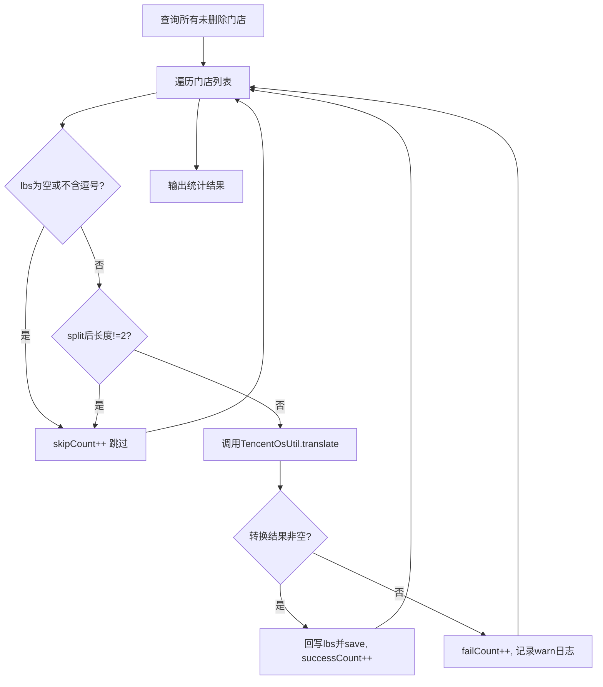

> HTML 页面: [[page/wiki/data/添可项目/老中台/2026年/20260722百度地图迁移腾讯地图/门店APP坐标转换方案.html|打开 HTML 页面]]

# 现状

门店表sp_store_info中保存的经纬度lbs字段，保存的是百度地图的经纬度

# 接口概览

| 接口                                                         | 路径                 | 用途             |
| ------------------------------------------------------------ | -------------------- | ---------------- |
| [testTranslate](file://E:\code_d\dbu-platform-2.0\ecovacs-store\store-mgr\src\main\java\com\ecovacs\store\mgr\controller\task\RunController.java#L305-L311) | `/testTranslate`     | 单条坐标转换测试 |
| [translateStoreLbs](file://E:\code_d\dbu-platform-2.0\ecovacs-store\store-mgr\src\main\java\com\ecovacs\store\mgr\controller\task\RunController.java#L565-L597) | `/translateStoreLbs` | 批量门店坐标转换 |

---

testTranslate核心代码：

```
package com.ecovacs.store.util;

import com.alibaba.fastjson.JSONArray;
import com.alibaba.fastjson.JSONObject;
import com.ecovacs.common.pojo.http.HttpResult;
import com.ecovacs.common.util.http.HttpClientUtils;
import com.ecovacs.store.cache.ConfigCacheManager;
import com.ecovacs.store.constants.ConfigKeyConstant;
import org.apache.commons.lang3.StringUtils;
import org.slf4j.Logger;
import org.slf4j.LoggerFactory;


/**
 * 腾讯地图工具类，提供坐标转换等地图相关功能
 *
 * @date: 2023/5/12 16:20
 */
public class TencentOsUtil {

    private static final Logger logger = LoggerFactory.getLogger(TencentOsUtil.class);

    /**
     * 腾讯地图坐标转换API地址
     */
    private static final String TRANSLATE_API_URL = "https://apis.map.qq.com/ws/coord/v1/translate";

    /**
     * 腾讯地图API返回成功的状态码
     */
    private static final int API_STATUS_SUCCESS = 0;

    /**
     * 腾讯地图坐标转换(将百度坐标转换为腾讯坐标)
     *
     * @param longitude 百度经度，不能为空
     * @param latitude  百度纬度，不能为空
     * @return 转换后的腾讯坐标，格式为"lng,lat"；转换失败时返回null
     */
    public static String translate(String longitude, String latitude) {
        // 参数非空校验
        if (StringUtils.isBlank(longitude) || StringUtils.isBlank(latitude)) {
            logger.warn("腾讯地图坐标转换参数不合法, longitude={}, latitude={}", longitude, latitude);
            return null;
        }

        try {
            String key = ConfigCacheManager.getConfigValue(ConfigKeyConstant.SP_TENCENT_OS_KEY);
            if (StringUtils.isBlank(key)) {
                logger.error("腾讯地图API Key未配置或为空");
                return null;
            }

            String url = TRANSLATE_API_URL + "?locations=" + latitude + "," + longitude + "&type=3&key=" + key;
            HttpResult httpResult = HttpClientUtils.doGet(url);

            if (httpResult == null || !httpResult.isSuccess()) {
                logger.error("调用腾讯地图坐标转换API请求失败, longitude={}, latitude={}, httpResult={}",
                        new Object[]{longitude, latitude, httpResult});
                return null;
            }

            JSONObject jsonObject = JSONObject.parseObject(httpResult.getBody());
            if (jsonObject == null) {
                logger.error("腾讯地图坐标转换API返回数据解析为空, longitude={}, latitude={}", longitude, latitude);
                return null;
            }

            // 校验API返回状态码，status=0表示成功
            Integer status = jsonObject.getInteger("status");
            if (status == null || status != API_STATUS_SUCCESS) {
                logger.error("腾讯地图坐标转换API返回异常状态, longitude={}, latitude={}, status={}, message={}",
                        new Object[]{longitude, latitude, status, jsonObject.getString("message")});
                return null;
            }

            JSONArray locations = jsonObject.getJSONArray("locations");
            if (locations == null || locations.isEmpty()) {
                logger.warn("腾讯地图坐标转换API未返回有效坐标数据, longitude={}, latitude={}", longitude, latitude);
                return null;
            }

            JSONObject coordinate = locations.getJSONObject(0);
            String location = coordinate.getString("lng") + "," + coordinate.getString("lat");
            logger.info("腾讯地图坐标转换成功, 原始坐标=({},{}), 转换后坐标={}",
                    new Object[]{longitude, latitude, location});
            return location;
        } catch (Exception e) {
            logger.error("调用腾讯地图坐标转换API发生异常, longitude=" + longitude + ", latitude=" + latitude, e);
            return null;
        }
    }

}

```

translateStoreLbs核心代码

```
/**
     * 批量将门店百度坐标转换为腾讯坐标并保存
     * 查询所有未删除且lbs不为空的门店，逐条调用腾讯地图坐标转换接口后回写
     *
     * @return 转换结果统计
     */
    @RequestMapping("/translateStoreLbs")
    @ResponseBody
    public Result translateStoreLbs() {
        logger.info("translateStoreLbs start");
        SpStoreInfoDao storeInfoDao = ServiceManager.getService(SpStoreInfoDao.class);
        List<SpStoreInfo> storeList = storeInfoDao.findByDeleteFlagNot(1);
        int successCount = 0;
        int skipCount = 0;
        int failCount = 0;
        for (SpStoreInfo store : storeList) {
            String lbs = store.getLbs();
            if (StringUtils.isEmpty(lbs) || !lbs.contains(",")) {
                skipCount++;
                continue;
            }
            String[] split = lbs.split(",");
            if (split.length != 2) {
                skipCount++;
                continue;
            }
            String translated = TencentOsUtil.translate(split[0].trim(), split[1].trim());
            if (StringUtils.isNotEmpty(translated)) {
                store.setLbs(translated);
                storeInfoDao.save(store);
                successCount++;
            } else {
                failCount++;
                logger.warn("门店坐标转换失败, storeNo=" + store.getStoreNo() + ", lbs=" + lbs);
            }
        }
        logger.info("translateStoreLbs end, success=" + successCount + ", skip=" + skipCount + ", fail=" + failCount);
        return Result.success("转换完成, 成功:" + successCount + ", 跳过:" + skipCount + ", 失败:" + failCount);
    }
```


### 二、转换链路

```
百度坐标(BD-09) → 腾讯地图API(type=3) → GCJ-02坐标 → 回写sp_store_info.lbs字段
```


**核心工具类**：[TencentOsUtil.translate()](file://E:\code_d\dbu-platform-2.0\ecovacs-store\store-base\src\main\java\com\ecovacs\store\util\TencentOsUtil.java#L40-L92)

- **API地址**：`https://apis.map.qq.com/ws/coord/v1/translate`
- **转换类型**：`type=3`（百度坐标 → GCJ-02/腾讯坐标）
- **API Key**：从配置缓存读取，key为 `sp_tencent_os_key`
- **入参格式**：`latitude,longitude`（注意API请求中纬度在前）
- **出参格式**：`lng,lat`（经度在前，纬度在后）

---

### 三、数据存储

- **表**：`sp_store_info`
- **字段**：`lbs`（VARCHAR，格式 `"经度,纬度"`）
- **数据范围**：`delete_flag != 1` 的所有门店

---

### 四、批量转换流程（translateStoreLbs）




---

### 五、测试结果

| 转换前                                                       | 转换后                                                       |
| ------------------------------------------------------------ | ------------------------------------------------------------ |
| sp_store_info表中的lbs字段，为百度地图经纬度，如：120.604716,31.194689 | 转换后，sp_store_info表中的lbs字段，为腾讯地图经纬度，如：120.598208,31.190135 |

